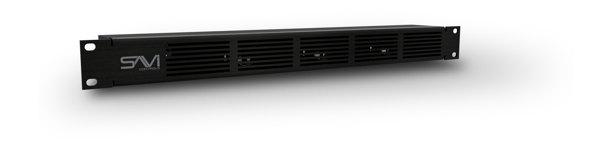

# Kona Datasheet

**SAVI Kona** has been cooling AV racks for over a decade. Drawing in air from the front and pushing it out the back, Kona creates a stream of airflow over each component, increasing the reliability and longevity of your hardware by maintaining safe operating temperatures. The pre-mounted fan core on vibration isolators delivers the ultimate quiet cooling experience at only 20dB.

## Key Benefits

* Creates a 20-cfm constant airflow stream over each component
* Maintains safe operating temperatures for equipment and eliminates downtime from overheating
* Saves rack space in a sleek 1RU design with rack ears included
* Pre-mounted fan core on vibration isolators at only 20 dB

## Specifications

<table>
<tr><th>   Power      </th></tr>
<tr><th> Requirements </th><td> 100V-240V ~ 50/60Hz input to included AC/DC power supply </td></tr>
<tr><th> Consumption </th><td> 90 Watts  </td></tr>
<tr><th> Connection </th><td> Switching Power Supply AC/DC adapter - Operation from 100VAC +/-15% 2.1mm power plug  </td></tr>
</table>

<table>
<tr><th>   Environmental   </th></tr>
<tr><th>  Rack Spacing  </th><td>  1RU  </td></tr>
<tr><th>  Operating Temperature  </th><td>  0°F to 180°F (-18°C to 82°C)  </td></tr>
<tr><th>  Dimensions - (HxWxD)  </th><td>  1.75” x 19” x 2.543”  </td></tr>
<tr><th>  Weight  </th><td>  1.36 lb  </td></tr>
<tr><th>  Mounting  </th><td>  19” rack mount with included ears  </td></tr>
<tr><th>  Fan dB Level  </th><td> 20 dB </td></tr>
<tr><th>  Airflow  </th><td> 20 CFM </td></tr>
</table>
