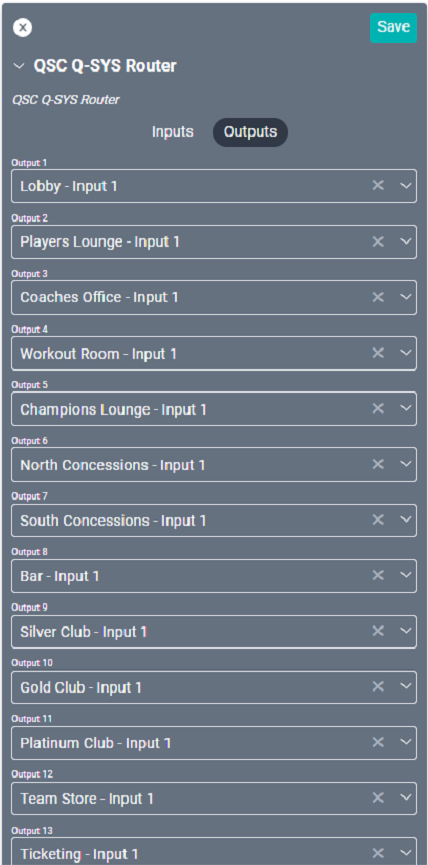

# Q-SYS DSP Configuration Guide

## Getting Started 
When configuring a DSP, it’s important to know what is required for drivers within SAVI to correctly control that DSP. No matter the complexity of the setup within the DSP software, there are only three elements that are important to SAVI:

* Router output named controls
* Gain named controls
* Mute named controls

>***Note: Router Mute control name is optional***

When configuring the drivers in SAVI Creator, the named controls must match the names in Q-SYS Designer. The named controls will need to be added to the list in the Q-SYS Designer by opening the router properties and click-and-dragging the inputs into the Named Controls window in the left of the UI. These can be renamed as needed.

You will also need to add Gain and Mute control names to the Named Controls list for the level drivers.

## Q-SYS Designer Configurations
There are four best practices for using Q-SYS DSPs with SAVI:
* A simple matrix configuration with 1-to-1 connections
* Using mixers to combine inputs
* Adding equalizers to inputs to adjust audio levels
* Adding compressors to mic inputs to control dynamic ranges

All of these can be mixed and matched for added complexity and control over your audio. No matter how large your project or how many devices you use, these configurations can be utilized for optimal SAVI integration.

### Simple Matrix Only
In this configuration, physical inputs will directly connect to the router. Each router will then connect to an individual gain control then to each physical output. This setup is the most direct configuration and will allow SAVI to direct any of the inputs to any of the outputs as well as control gain levels for each output.

1. Begin by individually connecting each **Input** to the **Router** component
   * Labels are useful for quick reference
2. Each **Router** Output should individually connect to a **Gain Component**
3. Each **Gain Component** should individually connect to an **Output**

### Event Space Mixer
This configuration utilizes isolated mixes as sources for SAVI to select. Be sure to route each mixer into separate router inputs.

1. Begin by individually connecting two or more **Inputs** to a **Mixer** component
2. Each **Mixer** should connect to a separate **Router Input**
3. Each **Router Output** should individually connect to a **Gain Component**
4. Each **Gain Component** should individually connect to an **Output**

### EQ and Mixer
This configuration builds on the previous two by adding an equalizer to each input. These EQs are not controllable by SAVI but will still affect source input audio.

1. Begin by individually connecting each **Input** to an **EQ** component
2. Connect each **EQ** component either directly to the **Router** or to a **Mixer**
3. Each **Mixer** should connect to a separate **Router Input**
4. Each **Router Output** should individually connect to a **Gain Component**
5. Each **Gain Component** should individually connect to an **Output**

### EQ, Compressor, and Mixer
This configuration further builds on the previous ones by adding compressors. Compressors may be used to control the dynamic range of sources and is generally reserved for microphones. It is not recommended for most sources as they can compromise audio quality if setup improperly.

Much like equalizers, compressors are not controllable or even viewable within SAVI. They will still affect source audio.

1. Begin by individually connecting each **Input** to an **EQ** component
2. Connect each **EQ** component either directly to the **Router** or to a **Mixer**
   * **Mic Input EQs** should connect to a **Compressor** and the **Compressor** should connect to the **Mixer**
3. Each **Mixer** should connect to a separate **Router Input**
4. Each **Router Output** should individually connect to a **Gain Component**
5. Each **Gain Component** should individually connect to an **Output**

## Creator Configurations
Once the DSP is configured the correct drivers must be added and configured within SAVI. This is done through SAVI Creator. These drivers will work with any of the Q-SYS configurations covered in this guide as all complexity is added before the router.

### Adding Equipment
The first step is adding the equipment drivers within Creator. Ensure all Q-SYS driver IP address’s are identical.

1. Add source drivers.
    * Sources can be any audio or video that can be routed to the DSP. Controllable sources will each have their own named driver (such as **DirecTVs**, **Ovation**, and **Rockbot** music players).
    * Configure non-controllable sources in SAVI by using **Generic Source** drivers (such as direct audio input or mixes).
2. Add a **QSC Q-SYS Router** driver for controlling up to sixty-four inputs and/or outputs. Add additional router drivers as needed.
3. Add **QSC Q-SYS Level** drivers for each **Audio Zone** you wish to control volume.
4. Add **Audio Zone** drivers for each grouping of speakers you wish to control.
    * You will need to set the appropriate **QSC Q-SYS Level** driver as the **Alternate Volume Control** within each **Audio Zone** driver.

When configuring the Q-SYS drivers, the correct Named Controls must be used for each field. See how the router output 1 control name is used in the **Q-SYS Router** driver under **Output Control Name 1**. Also observe that the **Gain Control Name** and **Mute Control Name** both match the named controls within Q-SYS Designer.

Here are the Q-SYS drivers and the Audio Zone driver within Creator for a reference of what they look like when configured.

Please note the different Control Name fields on the Q-SYS drivers as well as the Alternate Volume Control on the Audio Zone driver.

>***Note: SAVI recommends naming Level drivers after output numbers rather than the Audio Zone it will be connected to.***

### Connections
Once the drivers are added to the SAVI project, connections will need to be configured for each. Luckily, SAVI simplifies this process by allowing all of it to be configured through the router driver.

1. In the **Router** driver, select the appropriate source for each of the Inputs.
   * Remember that **Inputs** will connect to source outputs (ex.: A DirecTV source will show as DirecTV - Output).
2. For **Outputs**, select the appropriate **Audio Zone** or other equipment.

>***Note: Be sure to only use Input 1 for each Audio Zone connection***

**Sources**

</a>

**Router Inputs**

**Router Outputs**

**Outputs (Audio Zones)**

**Level Drivers (Alternate Volume Control)**

>***Note: QSC Q-SYS Level drivers do not have any connections. Instead, the Audio Zone driver uses the Alternate Volume Control dropdown to select the appropriate Level driver.***

## Volume Presets
Once the drivers are configured within Creator, Volume Presets will need to be enabled for each Audio Zone. In Facility View, select Volume Presets from menu dropdown. You will see the modal below. Select one or more Audio Zones from the list (use the search bar if needed) and enable any of the Volume Presets. The names for these are global and configured within Creator. Set the volume levels as desired.

**SAVI 3**

**SAVI 2**

## Facility View
You can verify drivers are correctly configured by using them within Facility View.

1. Select an **Audio Zone** then one of the available sources from the list on the right.
   * Verify that the source plays on the Audio Zone.
2. Change to a different **Volume Preset**.
   * Verify that volume levels change as indicated.
3. Click **Off** to mute the zone.
   * Verify that the selected zone is muted.
4. Select a new source from the list.
   * Verify that the source changes and volume is no longer muted.

**SAVI 3**

**SAVI 2**

