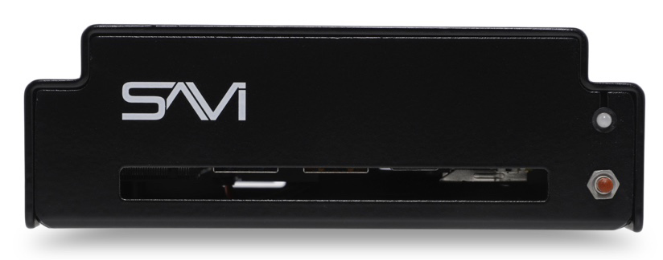
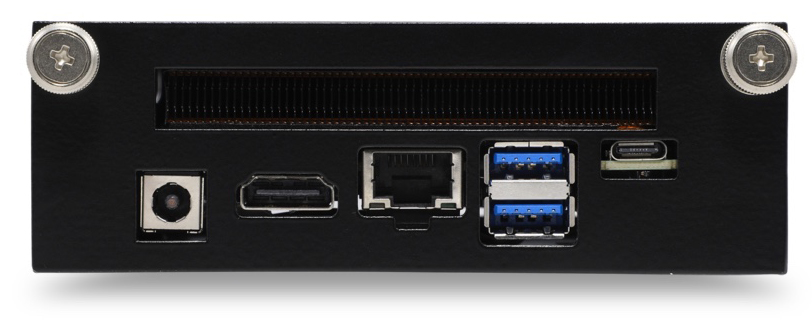

# SAVI Server Backup Datasheet

Providing redundancy for your project, **SAVI Backup Server** mirrors every setting from SAVI Server Pro – making it ready for manual failover at any time. With over a decade of proven reliability, power, and performance, you can be confident SAVI will keep your project running even if things go wrong.

## Key Benefits

*   All the features, power, and reliability of SAVI Server Pro, providing live backup for quick and easy replacement
* Fits into a single slot of our modular, 3-slot 1U Chassis
* Front panel power reset button for easy access
* Includes the first year of Annual Support & Maintenance

## Specifications

|   Hardware      |                       |
| --------------- |-----------------------|
| CPU | Intel® Core™ i5-10210U Processor (6M Cache, up to 4.20 GHz) |
| RAM     | 16GB DDR4 RAM                |
| Storage     | 250GB SSD                |

|   Network      |                       |
| --------------- |-----------------------|
| Connectivity | 10/100/1000 Mbps Ethernet |
| Lan Port     | 8pin RJ45 port with Status LEDs       |

|   Power      |                       |
| --------------- |-----------------------|
| Requirements | 100V-240V ~ 50/60Hz input to included AC/DC power supply |
| Consumption     | 90 Watts       |
| Connection     | Switching Power Supply AC/DC adapter - Operation from 100VAC +/-15% 2.1mm power plug       |

|   I/O      |                       |
| --------------- |-----------------------|
| User Interface | Browser based UI |
| IP Control/Interaction     | Ethernet connection, (2) USB 3.0, (1) USB-C       |
| Power Reset Button     | Front panel access       |

|   Environmental      |                  |
| --------------- |-----------------------|
|  Rack Spacing  |  1RU chassis fits 3 CPU sleds  |
|  Operating Temperature  |  32°F to 122°F (0°C to 50°C)  |
|  Storage Temperature  |  -40°F to 140°F (-40°C to 60°C)  |
|  Dimensions - (HxWxD)  |  1.625” x 4.75” x 5.25”  |
|  Mounting  |  19” rack mount with included ears and rubber feet for cabinet installations  |
|  Weight - CPU Sled  |  1 lb  |

|   Included Accessories      |                       |
| --------------- |-----------------------|
| Power Supply     | 19V, 65W wall-mount AC-DC power adapter       |
| Support and Maintenance     | One year Annual Support & Software Maintenance (ASM) included.       |

|   Optional Accessories      |                       |
| --------------- |-----------------------|
| SAVI 1U Chassis | SEN-01 can hold up to 3 total sleds (SAVI Server/Backup Server/CPU Sled) |
