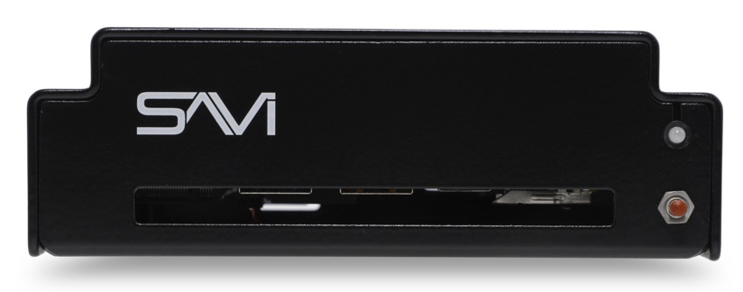
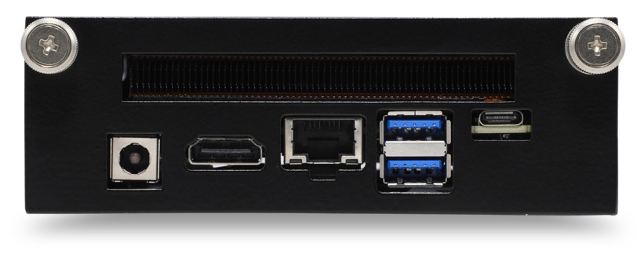

# SAVI Server CPU Datasheet

Whether it’s remote log-in software for 24-7 support or specialty software for interactive graphics, the CPU Sled can run Windows or most flavors of Linux, making it compatible with virtually any software package. Sleek and industrial, CPU sled is highly versatile fitting into a single slot of our 3-slot 1U chassis (SEN-01).

## Key Benefits

* Over a decade of proven performance, power, and reliability  
* Versatile and customizable for music, digital signage, remote monitoring, and more
* Fits into a single slot of our modular, 3-slot 1U chassis with space for two additional processors, e.g., SAVI Server Pro, Backup Server, or lighting control
* Front panel power reset button for easy access
* Includes the first year of Annual Support & Maintenance

## Specifications

|   Hardware      |                       |
| --------------- |-----------------------|
| CPU | Intel® Core™ i5-10210U Processor (6M Cache, up to 4.20 GHz) |
| RAM     | 16GB DDR4 RAM                |
| Storage     | 250GB SSD                |
| Operating System     | Ubuntu 22.04                |

|   Network      |                       |
| --------------- |-----------------------|
| Connectivity | 10/100/1000 Mbps Ethernet |
| Lan Port     | 8pin RJ45 port with Status LEDs       |

|   Power      |                       |
| --------------- |-----------------------|
| Requirements | 100V-240V ~ 50/60Hz input to included AC/DC power supply |
| Consumption     | 90 Watts       |
| Connection     | Switching Power Supply AC/DC adapter - Operation from 100VAC +/-15% 2.1mm power plug       |

|   I/O      |                       |
| --------------- |-----------------------|
| Display | HDMI |
| Control/Interaction     | Ethernet connection, (2) USB 3.0, (1) USB-C       |
| Power Reset Button     | Front panel access       |

|   Environmental      |                  |
| --------------- |-----------------------|
|  Rack Spacing  |  1RU chassis fits 3 CPU sleds  |
|  Operating Temperature  |  32°F to 122°F (0°C to 50°C)  |
|  Storage Temperature  |  -40°F to 140°F (-40°C to 60°C)  |
|  Dimensions - (HxWxD)  |  1.625” x 4.75” x 5.25”  |
|  Mounting  |  19” rack mount with included ears and rubber feet for cabinet installations  |
|  Weight - CPU Sled  |  1 lb  |

|   Included Accessories      |                       |
| --------------- |-----------------------|
| Power Supply     | 19V, 65W wall-mount AC-DC power adapter       |
