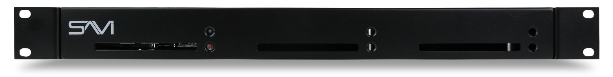
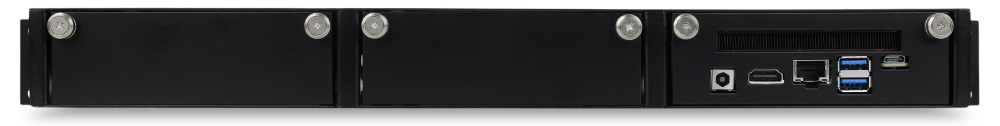

# SAVI Server Pro Datasheet

**SAVI Server Pro** is the heart of SAVI 3 system, with over a decade of proven performance and reliability capable of controlling any size commercial project with power to spare. Designed for speed, efficiency, and flexibility, SAVI Server Pro controls thousands of devices over the network, including lighting, displays, audio zones, thermostats, and more. With a scalable and industrial design, SAVI Server Pro fits into a single slot of our 3-slot 1U chassis and features the built-in SAVI 3 control and automation platform, enabling integrators to program entire systems in just hours.

## Key Benefits

*   Built-in SAVI 3 control and automation system, including SAVI Creator, Canvas, and the ultra-responsive, browser-based UI
*   Includes native, no-code tools like Map View, Game View, and dedicated space for SAVI Show graphics and slideshows
*   Modular, scalable chassis for simplified installation with space for two additional processors, e.g., backup server, music services, or lighting control
*   Seamless SAVI ecosystem interoperability and API integration for 3rd party products
*   Front panel power reset button for easy access
*   Includes the first year of Annual Support & Maintenance

## Specifications

|   Hardware      |                       |
| --------------- |-----------------------|
| CPU | Intel® Core™ i5-10210U Processor (6M Cache, up to 4.20 GHz) |
| RAM     | 16GB DDR4 RAM                |
| Storage     | 250GB SSD                |

|   Network      |                       |
| --------------- |-----------------------|
| Connectivity | 10/100/1000 Mbps Ethernet |
| Lan Port     | 8pin RJ45 port with Status LEDs       |

|   Power      |                       |
| --------------- |-----------------------|
| Requirements | 100V-240V ~ 50/60Hz input to included AC/DC power supply |
| Consumption     | 90 Watts       |
| Connection     | Switching Power Supply AC/DC adapter - Operation from 100VAC +/-15% 2.1mm power plug       |

|   I/O      |                       |
| --------------- |-----------------------|
| User Interface | Browser based UI |
| IP Control/Interaction     | Ethernet connection       |
| Power Reset Button     | Front panel access       |

|   Environmental      |                  |
| --------------- |-----------------------|
|  Rack Spacing  |  1RU chassis fits 3 CPU sleds  |
|  Operating Temperature  |  32°F to 122°F (0°C to 50°C)  |
|  Storage Temperature  |  -40°F to 140°F (-40°C to 60°C)  |
|  Sled Dimensions - (HxWxD)  |  1.625” x 4.75” x 5.25”  |
|  Chassis Dimensions - (HxWxD)  |  1.72” x 19” x 5”  |
|  Mounting  |  19” rack mount with included ears and rubber feet for cabinet installations  |
|  Weight - CPU Sled  |  1 lb  |
|  Weight - CPU Sled with SEN-01  |  4.8 lbs  |

|   Included Accessories      |                       |
| --------------- |-----------------------|
| SAVI 1U Enclosure | SEN-01 can hold up to 3 total sleds (SAVI Server/Backup Server/CPU Sled) |
| Power Supply     | 19V, 65W wall-mount AC-DC power adapter       |
| Support and Maintenance     | One year Annual Support & Software Maintenance (ASM) included.       |

|   Optional Accessories      |                       |
| --------------- |-----------------------|
| Backup Server | Backup SAVI Server. Fits in 1RU SAVI Server Pro chassis. Mirrors SSP-01 project |
| Display License     | License required per every (1) display in project   |
| Video Processor License     | License required per every (1) external Video Wall Processor or Tiling Processor in project       |
| Blank Plate | Sled slot cover for 1U chassis (SENBP-01). Mounting screws included. |
