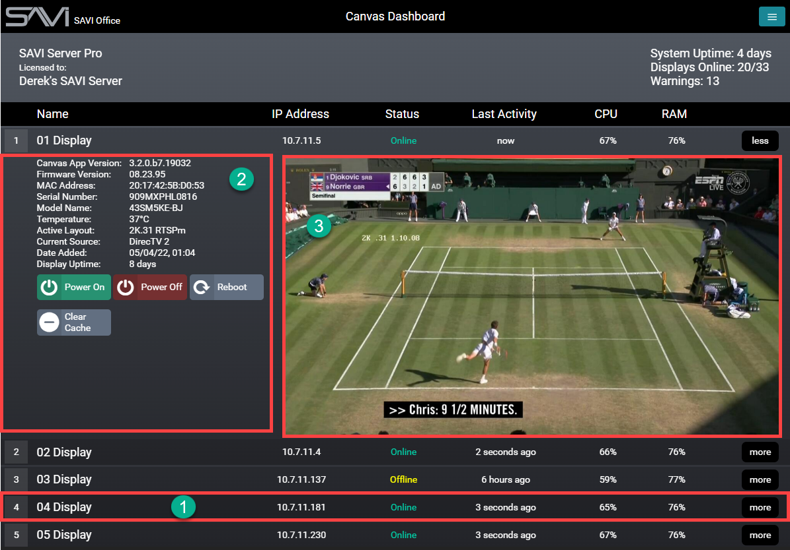
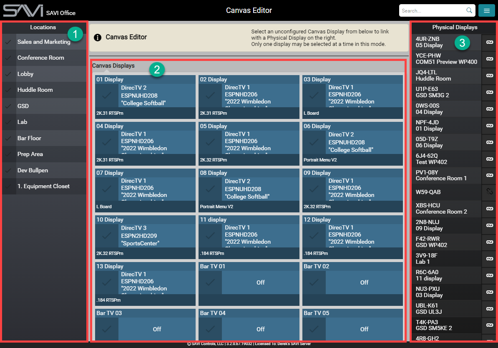
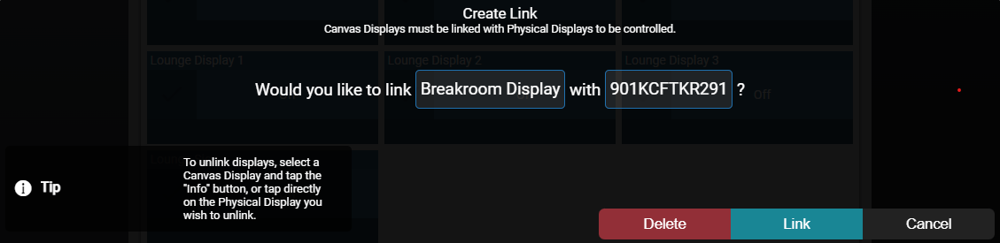
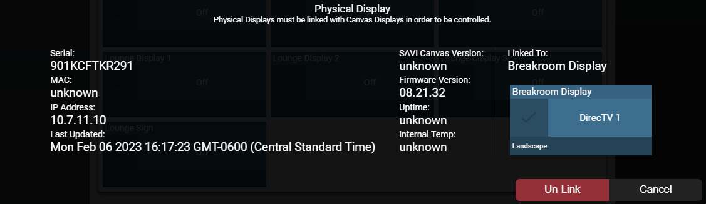

# Canvas Dashboard And Editor
SAVI Canvas is the backbone of the SAVI system. The Dashboard allows live monitoring of each display and the Editor is where you link physical displays to endpoints in Facility View.

## Canvas Dashboard

The Canvas Dashboard shows all physical displays and their information/status. This allows for easily monitoring hardware at a glance. The Canvas Dashboard excels at letting you find any offline or malfunctioning displays in your project.

This is also where you can upgrade the display firmware and SAVI app software.

Select anywhere on the row of the desired display to view the detailed status. You can power the device on/off, reboot, as well as upgrade the display firmware and SAVI app software.

>***Note: The Power Off function here will fully power the display down, unlike in Facility View where Power Off will only disable the backlight.***

1. **Display Listing:** The list is collapsed by default but will show the display name, IP address, online/offline status, last activity, CPU usage, and Ram usage for each connected display in the project.
2. **Status:** When selecting a display, detailed status information is on the left side. There's also buttons for controlling the power status and to clear the cache for the display.
3. **Feed:** When selecting a display, a direct feed image from the display is shown as well. This can be refreshed by selecting it.

>***Displays MUST be connected in Canvas Edit in order to appear in the Canvas Dashboard***

## Canvas Edit

Canvas Edit is how you connect physical displays to displays added in Creator and viewable in Facility View. This screen functions similar to the main Facility View interface. Selecting any connected display in the Endpoint stack highlights its connected physical display in the Right-Sidebar. Filters in the Left-Sidebar help in finding the display you need. Displays can also be searched for from the search bar.

1. **Locations:** Allows filtering by location set in Creator.
2. **Canvas Displays:** Alphabetically arranged by names set in Creator.
3. **Physical Displays:** Alphabetically arranged by six digit code.
4. **Display:** Displays the six digit code.

>***Note: Once connected, a layout must be enabled for the display. If the layout chosen has a source input, a source must be selected after the layout is assigned.***

### Linking A Display

1. Once the SAVI app has been installed on the display, it automatically presents a six-digit connection code.
2. In Canvas Edit, find the named display you wish to connect and select it.
3. In the Physical Displays list, find the six-digit connection code you want to link it to and select it.
4. The **Create Link** modal displays for confirmation. Verify this information is correct and click **Link**.

### Un-Linking A Display

1. In Canvas Edit, find the named display you wish to unlink and select it.
2. The six-digit connection code that display is connected to will automatically highlight in the Physical Displays list
3. Select it.
4. The **Physical Display** modal displays for confirmation. Verify this information is correct and click **Un-Link**.
