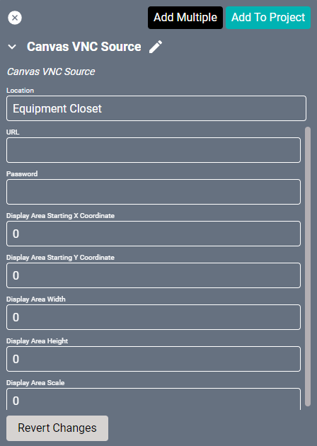

# Canvas Sources
The Canvas Source drivers allow direct linking to images, videos, VLC streams, or URLs. Once created, these drivers will appear as selectable sources in Facility View. No further confirmation is necessary.

## Image Source Driver
The Canvas Image Source driver allows linking directly to a hosted image rather than uploading the image to Show. This is especially useful for images that change frequently, allowing you to edit them on the host site while maintaining their connection to SAVI.

#### Properties

* **Name:** Name of Image.

* **Location:** Location of image within Project. New Locations can be created by selecting field, typing in a new name, and then selecting corresponding "Add New Tag" option or pressing Enter on your keyboard.

* **URL:** The URL of the image.
  >***Be sure to verify the image is hosted somewhere that allows direct linking.***

* **Append Timestamp:** This prevents image caching, allowing an updated image to display properly.

--------------

## Video Source Driver
The Canvas Video Source driver allows linking directly to a hosted video. This is useful for displaying a video stream from an encoder other than a Stream.One.

#### Properties

* **Name:** Name of the video or encoder.

* **Location:** Location of video or encoder within Project. New Locations can be created by selecting field, typing in a new name, and then selecting corresponding "Add New Tag" option or pressing Enter on your keyboard.

* **URL:** The URL of the video or stream (A YouTube video or playlist for example).
    >***Be sure to verify the video is hosted somewhere that allows direct linking.***

    >For YouTube videos, playlists, and live-streams, be aware there are a few limitations.
    >* If you get a "Video Unavailable" message, your video may have newer music which is more restricted than older music.
    >* Playlists must be set to public to be viewed.
    >* Only one YouTube source may be linked on any display/layout. An additional one stream from another source may be added, but additional streams will not display.
    >* Also note that individual videos will loop and playlists will loop starting with the first video.

* **Pro:Idiom Encrypted:** Enable this if the encoder uses LG's Pro:Idiom encryption technology.

------------

## Web Page Source Driver
The Canvas Web Page Source driver allows linking directly to a hosted page on a website. This allows displaying content created with HTML, Java, or any other web programming for a fully customizable experience.

#### Properties

* **Name:** Name of the website or webpage.

* **Location:** Location of website or webpage within Project. New Locations can be created by selecting field, typing in a new name, and then selecting corresponding "Add New Tag" option or pressing Enter on your keyboard.

* **URL:** The URL of the webpage.
  >***Be sure to verify the URL destination is hosted somewhere that allows direct linking.***

------------

## VNC Source Driver
This driver allows displaying a remote PC running a "websockify" based VNC (Virtual Network Computing). This is a direct connect display but does not allow remote control of the PC.

#### Properties

* **Name:** Name of Device.

* **Location:** Location of Device within Project. New Locations can be created by selecting field, typing in a new name, and then selecting corresponding "Add New Tag" option or pressing Enter on your keyboard.

* **URL:** The URL of the stream.

* **Password:** Login password of the device.

* **Display Area Starting X Coordinate::** Coordinates origin starts at the top-left of the content.

* **Display Area Starting Y Coordinate:** Coordinates origin starts at the top-left of the content.

* **Display Area Width:** The width of the stream in pixels.

* **Display Area Height:** The height of the stream in pixels.

* **Display Area Scale:** The scale of the display area.
