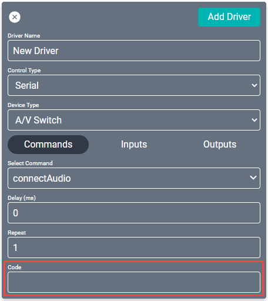
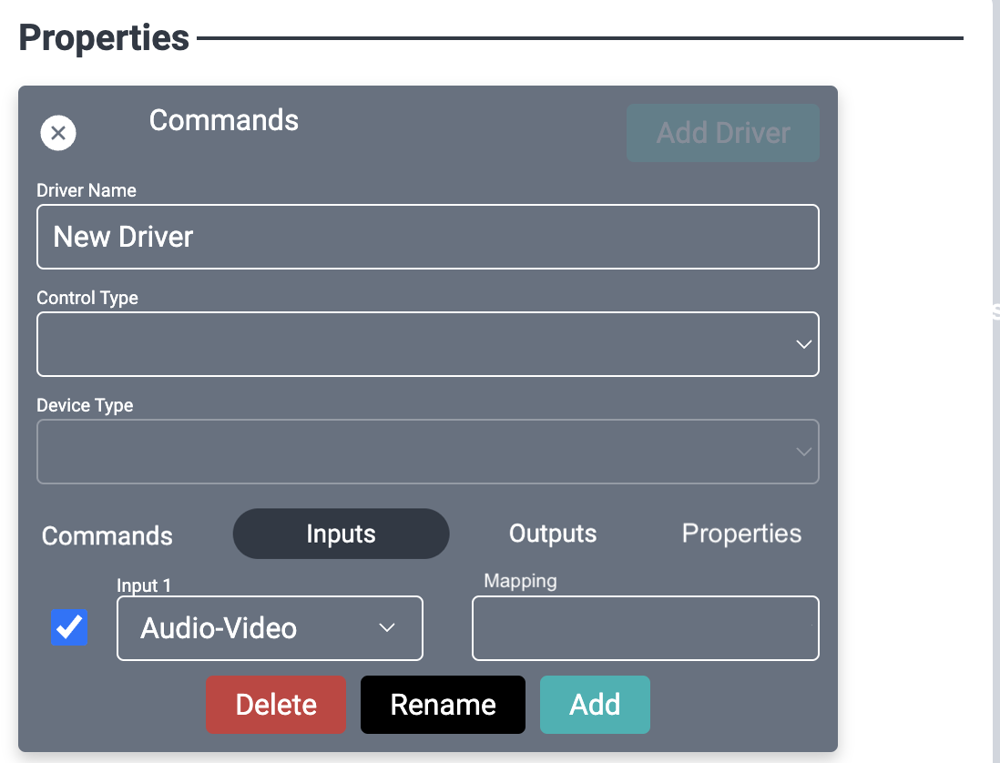

# Entering Special Codes into Custom Drivers

All of these can be used in the Code field within custom driver commands in Creator. You will need to select a command from the **Select Command** dropdown to view the **Code** field. 

Used for all controls types **except** for IR.

>***Note: Indicators may be case sensitive.***

## Encodings
Concat any single or multi-byte characters with any of these encoding indicators.

Do not include a space in-between the indicator and the byte segment; however, you may have spaces between byte segments.

Each segment in your code will require an indicator. 

* Hexadecimal
  * Indicator: `\x`
  * Example: If the code is `fa 00` then enter `\xfa \x00`
* Unicode
  * Indicator: `\u`
  * Example: If the code is `000d` then enter `\u000d`

## Special Characters
Include these indicators in your code as needed.

* Carriage Return: `\r`
* Line Feed: `\n`
* Tab: `\t`
* Backslash: `\\`

## Formatters
Including a formatting indicator `\%` will convert a variable to a desired encoding.

Formatters `\%` must immediately be followed by a substitution `<>`

* string
    * Indicator: `\%s`
    * Example: `\%s<argument.volume>`
    * Example: `\%s<device.address>`
* decimal
    * Indicator: `\%d`
    * Example: `\%d<argument.volume>`
    * Example: `\%d<device.address>`
* hexadecimal
    * Indicator: `\%x`
    * Example: `\%x<argument.volume>`
    * Example: `\%x<device.address>`
* octal
    * Indicator: `\%o`
    * Example: `\%o<argument.volume>`
    * Example: `\%o<device.address>`
* unsigned byte
    * Indicator: `\%b`
    * Example: `\%b<argument.x>` If x = 33, then this is the same as `\x21`
* unsigned word (little endian)
    * Indicator: `\%w`
    * Example: `\%w<argument.x>` If x = 676, then this is the same as `\x04\x2a`
* unsigned word (big endian)
    * Indicator: `\%W`
    * Example: `\%W<argument.x>` If x = 676, then this is the same as `\x2a\x04`
* unsigned long (little endian)
    * Indicator: `\*l`
    * Example: `\%l<argument.x>`. If x = 676, then this is the same as `\x04\x2a\x00\0x00`
* unsigned long (big endian)
    * Indicator: `\*L`
    * Example: `\%L<argument.x>`. If x = 676, then this is the same as `\x00\0x00\x04\x2a`

## Substitutions
Substitution indicators `<>` will allow you to use variables in your code.
Substitutions `<>` must be preceded with a formatter `\%`

### Device Property Substitutions
`<device.>` uses the specified device property

Please use the list below as available device properties

* `<device.address>`: will substitute the address of the device set in the device card under creator's equipment tab

### Command Argument Substitutions
`<argument.>` uses the argument passed to the command.

This will substitute the value of the argument when the command is called, whether through a macro or Facility View.

For example, if you change the volume of a custom device and the code includes `\%d<argument.volume>` the driver will pass the decimal value of the selected volume.

Not every command has arguments.

Please use the below as a comprehensive list of available command arguments:

* A/V Switch
  * **connectAudio** or **connectVideo**
    * `<argument.input>`: This will substitute the input's mapped value. If the input does not have a mapped value, this will use the input connection's name.
    * `<argument.output>`: This will substitute the output's mapped value. If the output does not have a mapped value, this will use the output connection's name.
  * **disconnectAudio** or **disconnectVideo**
    * `<argument.output>`: This will substitute the output's mapped value. If the output does not have a mapped value, this will use the output connection's name.

     <!--make this image inline with the connectAudio/disconnectAudio bullets-->

  * **mute**
    * `<argument.output>`: This will substitute the output's mapped value. If the output does not have a mapped value, this will use the output connection's name.
    * `<argument.mute>`: This will substitute true or false.
  * **setVolume**
    * `<argument.output>`: This will substitute the output's mapped value. If the output does not have a mapped value, this will use the output connection's name.
    * `<argument.volume>`: This will substitute the volume percentage converted to decibels based off the precision, multiplier, minimum decibels, and maximum decibels set in the driver's properties.
* TV
  * **setChannel**
    * `<argument.channel>`: This will substitute the channel number.
  * **setVolume**
    * `<argument.volume>`: This will substitute the volume percentage.
* Satellite
  * **setChannel**
    * `<argument.channel>`: This will substitute the channel number.
* Fan
  * **setSpeed**
    * `<argument.speed>`: This Will substitute fan speed as the following values:
      * 0 (off)
      * 1 (low)
      * 2 (medium)
      * 3 (medium-high)
      * 4 (high)
* Camera
  * **preset**
    * `<argument.index>`: This Will substitute the numerical index value

