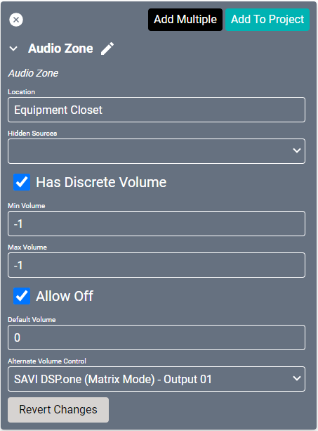
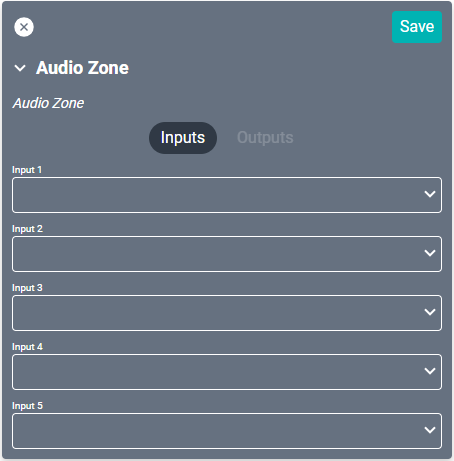

# Audio Zone Driver

Audio Zones allow control of one or more speakers. This control may be through a receiver or other device and may control one or more outputs on that device.

#### Properties

* **Name:** Name of the device.

* **Location:** Location of the device within the Project. New Locations can be created by selecting this field, typing in a new name, and then selecting the corresponding "Add New Tag" option or pressing Enter on your keyboard.

* **Hidden Sources:** Sources that are not shown when viewing the source select in Facility View for this audio zone.

* **Has Discrete Volume:** If true, this audio zone has discrete audio capability.

* **Min Volume:** Allows limiting the minimum allowable range of audio on the device. Set to -1 to disable.

* **Max Volume:** Allows limiting the maximum allowable range of audio on the device. Set to -1 to disable.

* **Allow Off:** Enabling this allows Facility View to control powering off this audio zone and connected devices.

* **Default Volume:** When an Audio Zone is off and a source is selected, this is the volume level that will be used. Note that this will not be used if an Audio Zone is already playing audio at a given volume. Value is percentage based.

* **Alternate Volume Control:** Device Port used when sending volume related commands (setVolume, volumeUp, volumeDown, mute). This is only needed when the port connected to the Audio Zone can not handle volume control (such as in a Yamaha MTX Matrix).

>***Alternate Volume Control can be ignored if the Audio Zone is connected to a Video Storm CMX3838A2 or Zektor PROAUDIO16 (or 32). But if you're using Yamaha MTX Matrix, you'll need a Yamaha MTX Zone driver and must select the MTX Zone as your Alternate Volume Control.***

### Connections

Audio Zones are restricted to five inputs, but those inputs may come from any audio source. Utilize matrix switches to output multiple sources through a Audio Zone with mixes.

##### Input

* **Input (1-5):** Each of these may connect to any amplifier output port.

>***If more than five inputs are needed, please contact SAVI Support.***
