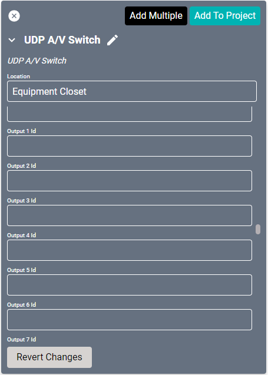
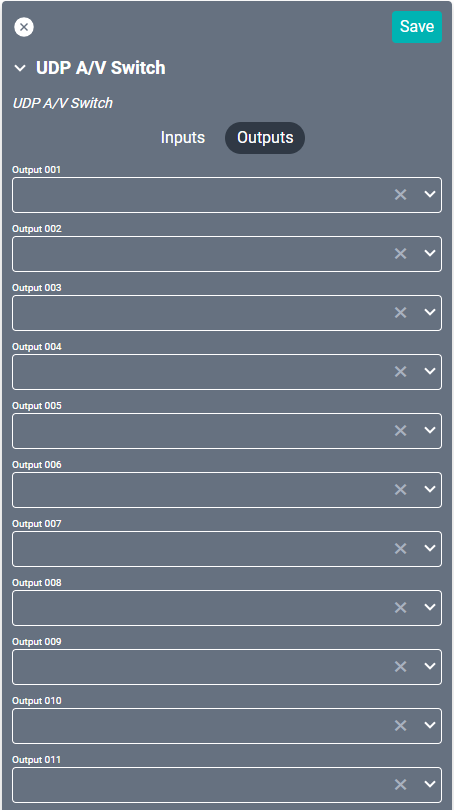

# AV Switch Drivers

This driver serves as a generic driver for controlling TCP and UDP AV Switches.

## TCP

Generic driver for controlling TCP A/V Switches.

#### Properties

* **Name:** Name of the device.

* **Location:** Location of the device within the Project. New Locations can be created by selecting this field, typing in a new name, and then selecting the corresponding "Add New Tag" option or pressing Enter on your keyboard.

* **IP Address:** The destination IP address that SAVI will use when communicating with the device.

* **Port:** The destination IP port that SAVI will use when communicating with the device. Defaults to 23.

* **Connect Format:** Format for the "connect" command (i.e. "PLAY {input} ON {output}"). The `{input}` string will be replaced with the value from the `Input (1-100) Id` property that corresponds to the input SAVI is attempting to play. The `{output}` string will be replaced with the value from the `Input (1-100) Id` property that corresponds to the input SAVI is attempting to play.
    > * Special characters can be entered by using `\x##` where `##` is the hexadecimal two digit ascii code for the character. For example, carriage return can be inserted using `\x0D`.

* **Output Splitter:** A string value used by SAVI to split up responses from the device. This is mostly used to improve the readability of logs and should be left blank unless SAVI support recommends adding some value.

* **Input (1-100) Id:** The value that should replace the `{input}` string within the `Connect Format` when attempting to play an input on an output. The `Input 1 Id` property corresponds to the `Input 001` connection, etc.

* **Output (1-100) Id:** The value that should replace the `{output}` string within the `Connect Format` when attempting to play an input on an output. The `Output 1 Id` property corresponds to the `Output 001` connection, etc.

#### Connections

##### Input

* **Input (001-099):** Up to ninety-nine sources supported (still restricted by physical hardware).

##### Output

* **Output (001-099):** Up to ninety-nine outputs supported (still restricted by physical hardware).

------------

### UDP

Generic driver for controlling UDP AV Switches.

#### Properties

* **Name:** Name of the device.

* **Location:** Location of the device within the Project. New Locations can be created by selecting this field, typing in a new name, and then selecting the corresponding "Add New Tag" option or pressing Enter on your keyboard.

* **IP Address:** The destination IP address that SAVI will use when communicating with the device.

* **Port:** The destination IP port that SAVI will use when communicating with the device. Defaults to 10001.

* **Connect Format:** Format for the "connect" command (i.e. "PLAY {input} ON {output}"). The `{input}` string will be replaced with the value from the `Input (1-100) Id` property that corresponds to the input SAVI is attempting to play. The `{output}` string will be replaced with the value from the `Input (1-100) Id` property that corresponds to the input SAVI is attempting to play.
    > * Special characters can be entered by using `\x##` where `##` is the hexadecimal two digit ascii code for the character. For example, carriage return can be inserted using `\x0D`.

* **Delimeter String:** A string value used by SAVI to split up responses from the device. This is mostly used to improve the readability of logs and should be left blank unless SAVI support recommends adding some value.

* **Input (1-100) Id:** The value that should replace the `{input}` string within the `Connect Format` when attempting to play an input on an output. The `Input 1 Id` property corresponds to the `Input 001` connection, etc.

* **Output (1-100) Id:** The value that should replace the `{output}` string within the `Connect Format` when attempting to play an input on an output. The `Output 1 Id` property corresponds to the `Output 001` connection, etc.

### Connections

##### Input

* **Input (001-099):** Up to ninety-nine sources supported (still restricted by physical hardware).

##### Output

* **Output (001-099):** Up to ninety-nine outputs supported (still restricted by physical hardware).
