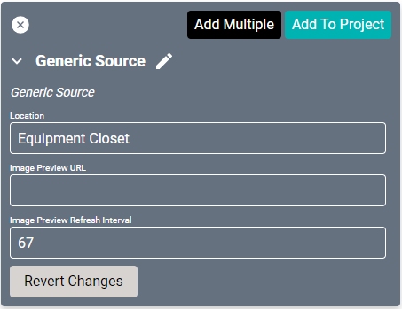
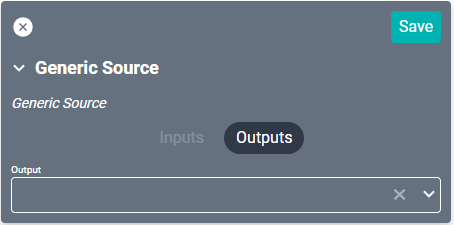

# Generic Source Driver

The Generic Source driver allows adding non-controllable sources to the system. From gaming systems to basic stereos, computer displays to undefined HDMI inputs, connect any device that doesn't have a specific driver and cannot accept commands.

#### Properties

* **Name:** Name of the device.

* **Location:** Location of the device within the Project. New Locations can be created by selecting this field, typing in a new name, and then selecting the corresponding "Add New Tag" option or pressing Enter on your keyboard.

* **Image Preview URL:** The URL to an image that SAVI will display in the “Remote Modal”. For Stream.One connected devices, this would show a live image preview containing the output from the device.

* **Image Preview Refresh Interval:** If you use the Image Preview, then this will set how often SAVI should refresh (reload) that image. If you chose a motion jpeg as the Image Preview, set this to 0.

### Connections

##### Output

* **Output:** Any input device.
