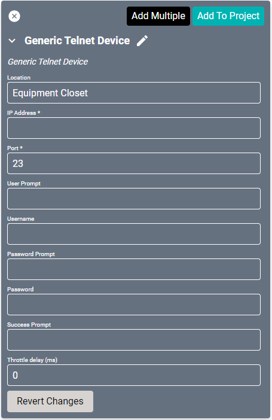

# Generic TCP Driver
This driver is for devices which have instructions to control them over telnet but are not yet supported by SAVI directly. Unlike the [AV Switches Driver](av-switches-driver.md), this driver may be used for any device.

#### Properties

* **Name:** Name of the device.

* **Location:** Location of the device within the Project. New Locations can be created by selecting this field, typing in a new name, and then selecting the corresponding "Add New Tag" option or pressing Enter on your keyboard.

* **IP Address:** The destination IP address that SAVI will use when communicating with the device.

* **Port:** The IP address port that the device is open to. Set to 23 by default.

* **User Prompt:** The prompt the systems sends to ask for a user name.

* **Username:** Login username of the device.

* **Password Prompt:** The prompt the systems sends to ask for a password.

* **Password:** Login password of the device.

* **Success Prompt:** The message displayed once a user has successfully connected and logged in.

* **Throttle delay (ms):** Controls the rate at which messages are sent to the device. (In milliseconds) Some devices may have a minimum delay requirement.
