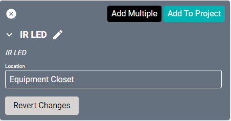

# IR LED Drivers

This is a custom built-in driver that can connect to any LED with IR control. Selecting the pencil icon in the Add Equipment list will allow editing the driver properties.

#### Properties

* **Name:** Name of the device.

* **Location:** Location of the device within the Project. New Locations can be created by selecting this field, typing in a new name, and then selecting the corresponding "Add New Tag" option or pressing Enter on your keyboard.

#### Edit Properties
Select the pencil icon to edit the base driver configuration. Information on configuring a custom driver can be found [here](/Knowledge-Base/Creator/Drivers/SAVI/creating-ir-rs232-drivers.md).

* **Driver Name:** Name of the driver (changes the default "IR LED").

* **Control Type:** Switches between IR and Serial.

* **Device Type:** Switches between the different types of devices that can be controlled.
  * TV - IR enabled TV.
  * LED - IR enabled LED.
  * Satellite - Configures device as an IR source (such as a satellite box or other source selector).

* **Select Command:** Sets the command when activating the driver.
  * Off - Turns the device off.
  * On - Turns the device on.
  * setColor - Sets the LED to a specific color.
  * color(01-16) - Sets the LED to one of the preset colors. These codes are pre-programmed with generic colors and can be edited to any LED color code.
  * delay - Sets a delay.
  >Selecting a command will add additional fields for that command.
* **Delay (ms):** Sets a delay in milliseconds before the command is sent.
* **Repeat:** Some IR commands require the command be repeated a specific number of times. This is set to 1 by default.
* **Code:** This is where the code is entered. This can be a standard IR code or one of the [special codes](/Knowledge-Base/Creator/Drivers/SAVI/rs232-special-codes.md).

### Connections
##### Input

* **IR In:** Connects to an IR module (i.e., the [SAVI Connect I/O IR Module](/Knowledge-Base/Creator/Drivers/SAVI/connect-io-drivers.md "SAVI Connect I/O IR Module")).
