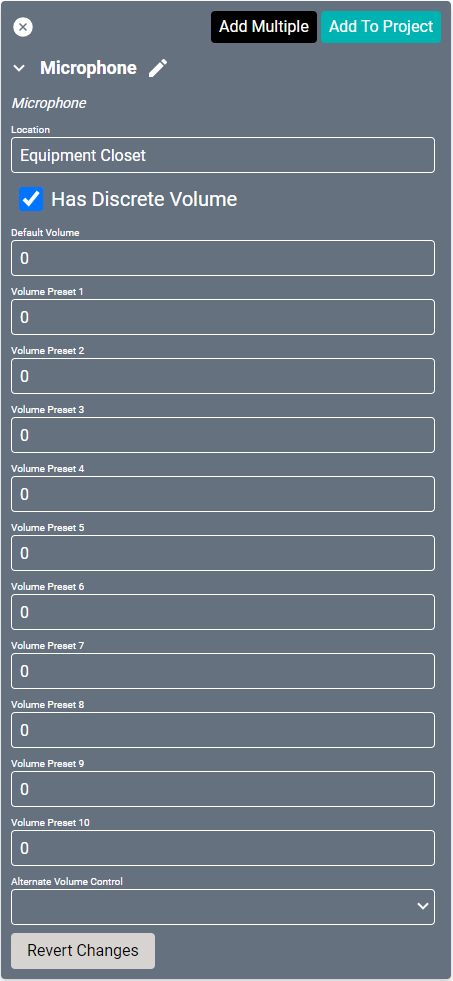
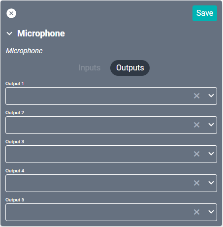

# Microphone Drivers

#### Properties

* **Name:** Name of the device.

* **Location:** Location of the device within the Project. New Locations can be created by selecting this field, typing in a new name, and then selecting the corresponding "Add New Tag" option or pressing Enter on your keyboard.

* **Has Discrete Volume:** If enabled, this audio zone has discrete audio capability.

* **Default Volume:** For discrete zones, this is the volume level sent to the device when it is turned on.

* **Volume Preset (1-10):** Volume level for # in preset names list.

* **Alternate Volume Control:** Device Port used when sending volume related commands (setVolume, volumeUp, volumeDown, mute). This is only needed when the port connected to the microphone can not handle volume control.

### Connections

##### Output

* **Output (1-5):** Connects to the Input of the audio device used for routing (such as the SAVI DSP).
