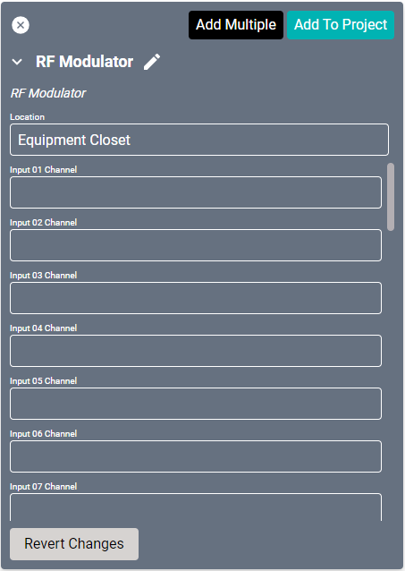
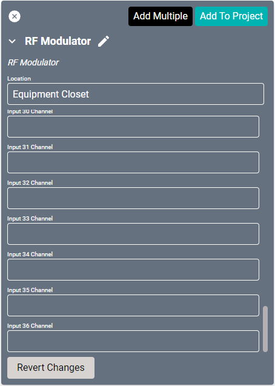
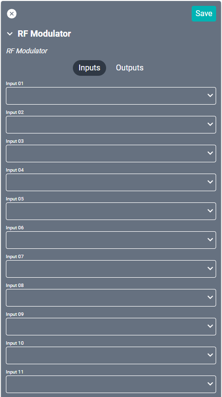
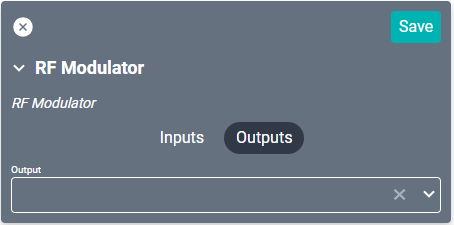

# RF Modulator Driver

RF Modulators convert audio/video sources into coaxial RF signals which can then be connected to displays (such as the Sunbrite IP TV). These do not work with canvas displays as those are not equipped with tuner inputs. This driver is uncontrollable in SAVI.

#### Properties

* **Name:** Name of the device.

* **Location:** Location of the device within the Project. New Locations can be created by selecting this field, typing in a new name, and then selecting the corresponding "Add New Tag" option or pressing Enter on your keyboard.

* **Input (01-36) Channel:** Assign channel numbers/names. These should match channels available from the inputs.

### Connections

##### Input

* **Input (1-36):** Up to thirty-six sources. Each source should match the device physically connected to the RF Modulator.

##### Output

* **Output:** RF output. This should be a display with a tuner input.
