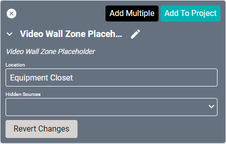
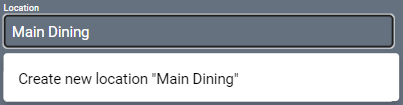
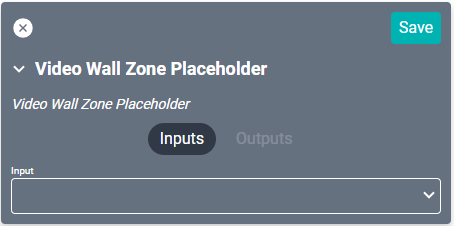

# Video Wall Zone Placeholder Driver

Much like the [TV Placeholder driver](https://kb.savicontrols.com/article/tv-placeholder/ "TV Placeholder driver"), this serves as a utility driver for generic video wall displays.

#### Properties

* **Name:** Name of the device.

* **Location:** Location of the device within the Project. New Locations can be created by selecting this field, typing in a new name, and then selecting the corresponding "Add New Tag" option or pressing Enter on your keyboard.

* **Hidden Sources:** Sources that are not shown when viewing the source select in Facility View for this display.

### Connections

##### Input

* **Input:** Source input (this should be a videowall driver).
