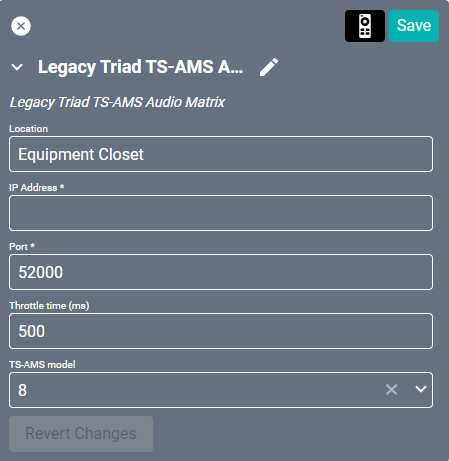
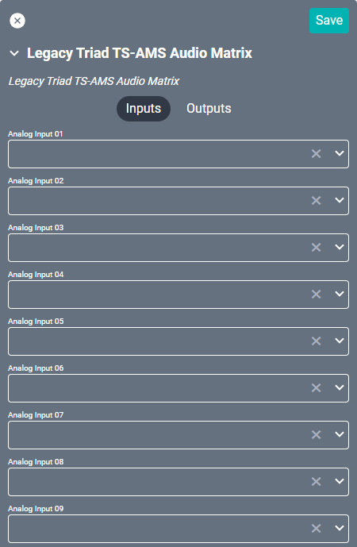
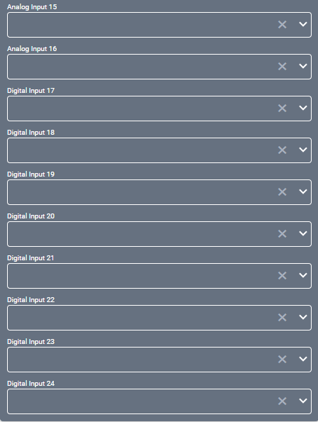
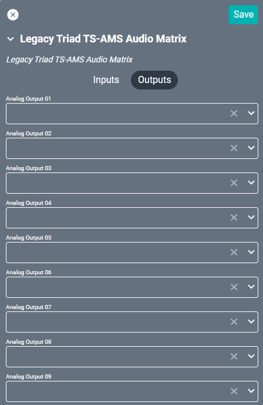

# Legacy Triad TS-AMS Audio Matrix Driver
This driver interfaces with this specific [Control4 power amplifier](https://www.control4.com/solutions/products/amplifiers-and-receivers/ "Control4 power amplifier"). Specifications on the matrix itself can be found on the Control4 site.

#### Properties

* **Name:** Name of the device.

* **Location:** Location of the device within the Project. New Locations can be created by selecting this field, typing in a new name, and then selecting the corresponding "Add New Tag" option or pressing Enter on your keyboard.

* **IP Address:** The destination IP address that SAVI will use when communicating with the device.

* **Port:** The network port used for the IP address. Set to 52000 by default.

* **Throttle time (ms):** This device may have issues processing too many commands at once. This value will be how many milliseconds to wait after each command to the unit. Set to 500 by default.

* **TS-AMS model:** Select if you are using the 8 or 24 model switch.

### Connections

##### Input

* **Analog Input (01-16):** Up to sixteen L/R audio sources.
  >***Note: When using the 8x8 model, only use the first 8 Analog Inputs.***

* **Digital Input (17-24):** Up to eight digital audio sources (coaxial or optical - 17-24 corresponds to 9-16 on the rear of the device).
  >***Note: When using the 8x8 model, only use the first 4 Digital Inputs (17-21 corresponds to 5-8 on the rear of the device).***

>***Note: Analog inputs 9-16 and digital inputs 17-24 overlap.***

##### Output

* **Analog Output (01-24):** Up to sixteen L/R audio outputs.
  >***Note: When using the 8x8 model, only the first 8 outputs are accessable.***

