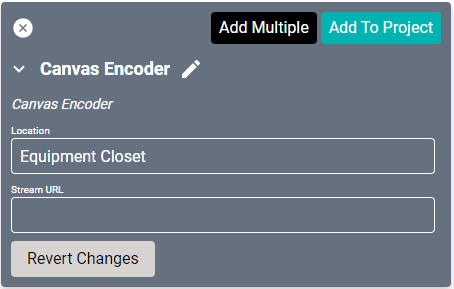
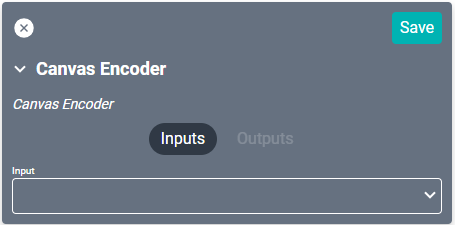

# SAVI Canvas Encoder Driver
This driver is usable with any device that supplies a compatible stream. It allows attaching a stream to a source so it appears in the Source list in Facility View.

#### Properties

* **Name:** Name of the device.

* **Location:** Location of the device within the Project. New Locations can be created by selecting this field, typing in a new name, and then selecting the corresponding "Add New Tag" option or pressing Enter on your keyboard.

* **Stream URL:** The base URL for this encoder (i.e. `rtp://239.1.1.1:5006`).

### Connections

##### Input

* **Input:** Connects to a video source.
