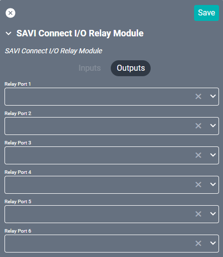

# SAVI Connect I/O Drivers

The SAVI Connect I/O driver interface with SAVI's Connect I/O hardware in order to add legacy devices to the SAVI 3 system. In conjunction, these allow control of IR, RS-232, and Relay devices. Step-by-step instructions can be found [here](/Knowledge-Base/Creator/Drivers/SAVI/creating-ir-rs232-drivers.md "SAVI Connect I/O Drivers page").

## IR Module

#### Properties

* **Name:** Name of the device.

* **Location:** Location of the device within the Project. New Locations can be created by selecting this field, typing in a new name, and then selecting the corresponding "Add New Tag" option or pressing Enter on your keyboard.

* **IP Address:** The destination IP address that SAVI will use when communicating with the device.

* **Timeout (MSec):** The amount of time in milliseconds to wait for the connect, send and response before aborting. Set to 3000 as default.

* **Delay After Success (MSec):** The amount of time in milliseconds to wait after a successful command before sending another. Set to 1000 as default.

* **Delay After Failure (MSec):** The amount of time in milliseconds to wait after a failed command before sending another. Set to 1000 as default.

* **Configuration of port (1-3):** These set the IR ports to either Emitter or Sensor.
  * Emitter - Creates and projects IR signals (output).
  * Sensor - Reads contact signals (input). This requires a GCSC1 Sensor Contact Closure be plugged into the same port on the physical Connect I/O. Corresponds to the "sensor" setting from the web configuration page, not "sensor notify."

### Connections

##### Output

* **IR Out (1-3):** Connects to any IR endpoint or receiver.

## RS-232 Module

#### Properties

* **Name:** Name of the device.

* **Location:** Location of the device within the Project. New Locations can be created by selecting this field, typing in a new name, and then selecting the corresponding "Add New Tag" option or pressing Enter on your keyboard.

* **IP Address:** The destination IP address that SAVI will use when communicating with the device.

### Connections

##### Output

* **RS232 Out 1:** Connects to any RS232 endpoint or receiver.

## Relay Module

#### Properties

* **Name:** Name of the device.

* **Location:** Location of the device within the Project. New Locations can be created by selecting this field, typing in a new name, and then selecting the corresponding "Add New Tag" option or pressing Enter on your keyboard.

* **IP Address:** The destination IP address that SAVI will use when communicating with the device.

### Connections

##### Output

* **Relay Port (1-6):** Connects to relay modules.
