

# SAVI Connect I/O Creating IR and RS232 Drivers
This guide is meant to be used for creating IR and RS232 drivers in SAVI Creator to work with SAVI Connect I/O or WP400s. Some utilities will need to be downloaded to successfully configure devices. Please ensure all devices are physically connected before configuration begins.

>***This setup does require that you are connected to the same VLAN as the CONNECT I/O or WP400 units.***

If using this to connect to WP400 instead of Connect I/O, serial connections must be used. Additionally, only one device will be connected per emitter, rather than the three devices like with IR.

### Download utilities
Utilities required to complete setup can be downloaded [here](../../../../Assets/Files/SAVI-Connect-io-Apps_04.26.21.zip "SAVI Connect I/O apps").

### Setup SAVI Connect I/O IR Ports
Before we get started in Creator, you will need to ensure the IR ports are setup correctly. We will be using SAVI Discover from the utility package to do this.

<a href="../../../../Assets/Knowledge-Base/Creator/Drivers/savi-discover-utility.png">
  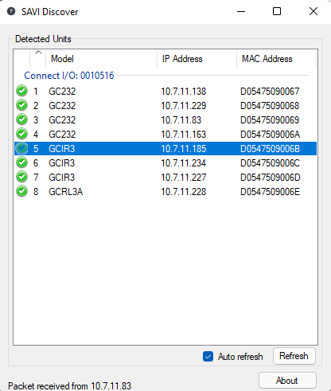
</a>

>Note: 1:GC232, from the back of the unit it is the first module on the left.  8:GCRL3A, from the back of the unit it is the module on the far right.

<a href="../../../../Assets/Knowledge-Base/Creator/Drivers/ir-module-main-page.png">
  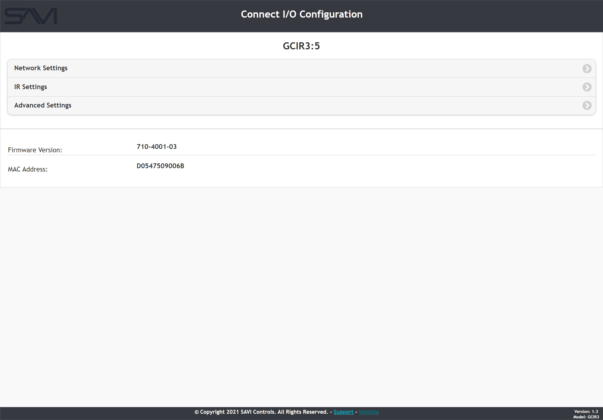
</a>

1. Run SAVI Discover utility and find the correct Connect I/O and select the IR module you wish to edit (GCIR3 listed as 5-7).
    >***The SAVI Discover utility will automatically discover CONNECT I/O units.***

2. Double click the IR module to launch the webpage for editing and navigate to the **Network Settings** page.

3. Set DHCP to **Disabled** and configure the IP to a static address.

4. Click **Apply Changes** when you are done.

The **IR Settings** page can be left alone as those settings will be defined in the Creator drivers.

### Create Drivers In SAVI Creator
Creating and connecting the various drivers needed can be complex and confusing. Each driver and their connections are detailed in their own section for clarity.

#### Connect I/O Driver
The first driver we'll need is the SAVI Connect I/O driver. This configures **one** of the three IR modules on the Connect I/O. You will need three of these drivers to utilize all three modules and all nine IR ports.

<a href="../../../../Assets/Knowledge-Base/Creator/Drivers/savi-connect-io-ir-module.png">
  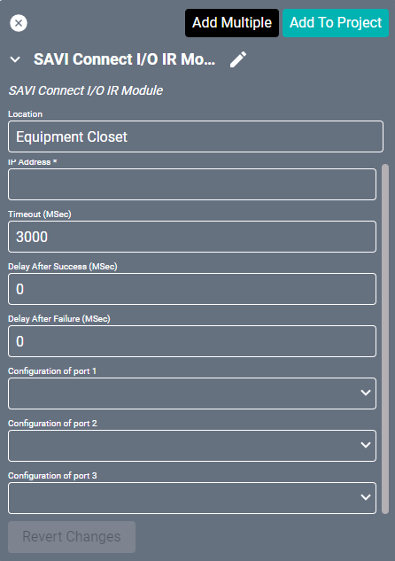
</a>

1. Under Equipment in Creator, search for the SAVI Connect I/O IR Module.

2. Rename this to the first IR module on the Connect I/O (you will need to make one for each of the three IR modules).

3. Fill in the IP Address with the static IP you set for the current module.

4. Change the settings to this configuration:
    >**Timeout:** `1000`
    >**Delay After Success:** `200`
    >**Delay After Failure:** `500`
    >**Configuration of port (1-3):** `Emitter`

5. Click Save to add driver to your project.

#### Custom IR Driver
This driver will need to be created first before it can be configured.

<a href="../../../../Assets/Knowledge-Base/Creator/Drivers/new-ir-driver-01.png">
  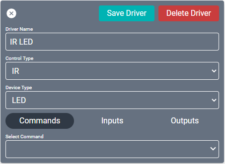
</a>
<a href="../../../../Assets/Knowledge-Base/Creator/Drivers/new-ir-driver-02.png">
  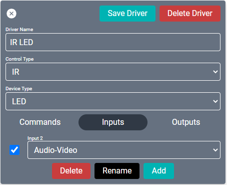
</a>

1. Click the blue **Add Driver** button in the Flexbar.

2. Name the driver the model number of the IR device you are connecting to.

3. Set the **Control Type** to IR and the **Device Type** to TV (Device Type should match what you are connecting to).

4. Under **Commands**, select the command you wish to code and input the **Code** in the feild.
    >Note: If you do not have the codes, use the steps below in the **Discovering IR Codes** section.

5. Under **Inputs**, click Add.

6. Select the check box, set the feild to **Audio-Video**, and click **Rename**.

7. Name the input HDMI 1.

8. Click **Add Driver**.

Now that the driver is created, it has been added to the Equipment list with all the other drivers. From here we will continue as if adding any other driver.

<a href="../../../../Assets/Knowledge-Base/Creator/Drivers/example-ir-driver.png">
  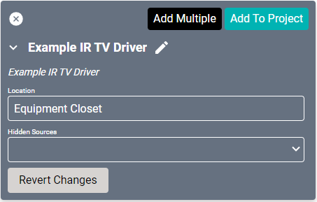
</a>

9. Search for your new driver in the **Add Equipment** section of the Flexbar (remember what you named it in step 2).

10. Name it to reflect the device or location (such as "Bar IR 1") and click **Add to Project**.

#### Connecting Drivers
Now we just need to connect our two drivers together.

<a href="../../../../Assets/Knowledge-Base/Creator/Drivers/example-bar-ir-driver.png">
  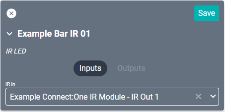
</a>

1. Under **Connections**, search for and select the custom driver you just added to the project (remember to use the name you used in step 10 of the **Custom IR Driver** section).

2. Connect the **HDMI 1** to the desired available HDMI source.

3. Connect the **IR In** to the Connect I/O port you set up earlier (use the name you created in step 2 of the **Connect I/O Driver** section).

4. Repeat these for each of the custom IR drivers you added to the project.
    >Note: Each **Connect I/O Driver** will have three IR Out connections that will correspond to the three IR ports of that module.

------------
### Discovering IR Codes
Learning IR codes from a remote requires the IR Learn utility from the download. You will also need access to the rear of the Connect I/O device. You will need to activate the remote about 6in from the IR sensor.

<a href="../../../../Assets/Knowledge-Base/Creator/Drivers/ir-learn-utility.png">
  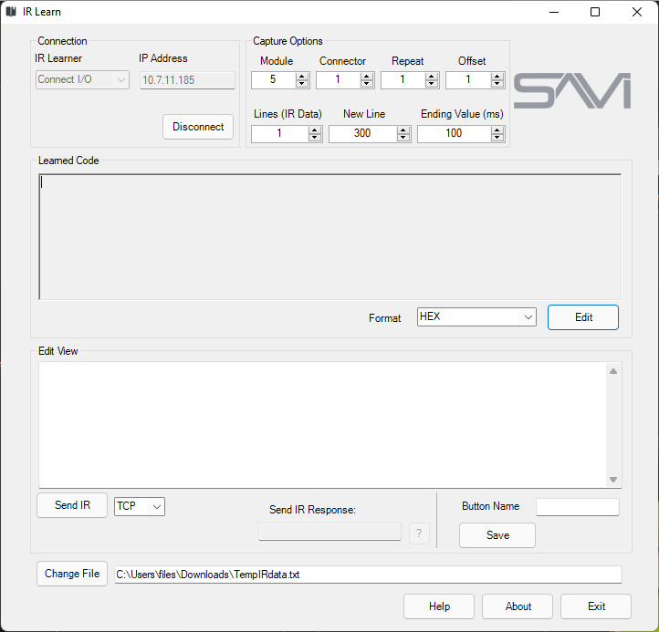
</a>

1. Launch **IR Learn** and select **Connect I/O** in the **IR Learner** dropdown.

2. Enter the correct IP address for the IR module and click **Connect**.

3. Under **Capture Options**, change the **Module** number to reflect the correct IR module (5-7) from the Connect I/O.

4. Select the dropdown for **Format** and select **HEX**.

5. Change the file location to a new/blank .txt file.

6. Press a button on the remote within view of the IR reader to record a code.
    >Remote should be about 6 inches away from the IR sensor on the back of the Connect I/O and button should be held for 1 second.

7. Select the new code under **Learned Code** and click **Edit** to convert to HEX.

8. Copy the code from the **Edit View** and paste them into the driver under **Code**.

9. Fill out the **Button Name** with the button you pressed to create the code and click **Save Driver**.

------------
When setting up RS232 (serial) connections, most settings will be similar. This section does not require using the previous IR section.

### Setup SAVI Connect I/O RS232 Ports

>***Note: GC232:1, from the back of the unit it is the first module on the left.  GCRL3A:8, from the back of the unit it is the module on the far right.***

<a href="../../../../Assets/Knowledge-Base/Creator/Drivers/rs232-module-main-page.png">
  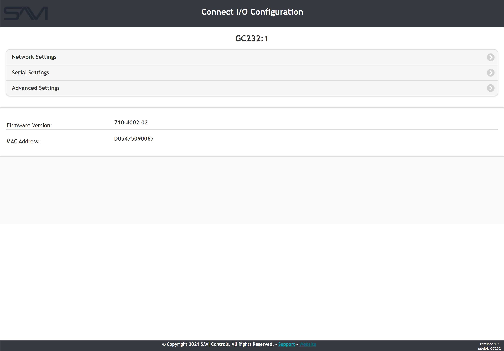
</a>

1. Run SAVI Discover utility and find the correct Connect I/O and select the RS232 module you wish to edit (GC232 listed as 1-4).
    > The SAVI Discover utility will automatically discover CONNECT I/O units.

2. Double click the RS232 module to launch the webpage for editing and navigate to the **Network Settings** page.

<a href="../../../../Assets/Knowledge-Base/Creator/Drivers/rs232-module-network.png">
  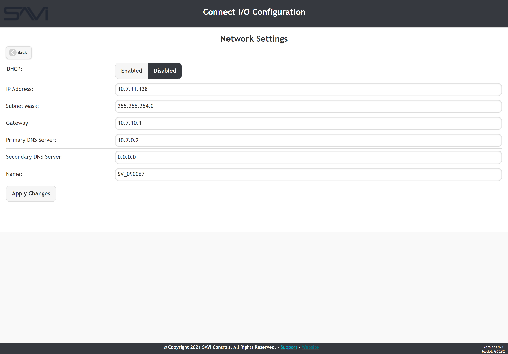
</a>

3. Set DHCP to **Disabled** and configure the IP to a static address.

4. Click **Apply Changes** when you are done.

The **Serial Settings** page can be left alone as those settings will be defined in the Creator drivers.

### Create Drivers In SAVI Creator
Creating and connecting the various drivers needed can be complex and confusing. Each driver and their connections are detailed in their own section for clarity.

Additionally, when setting up WP400s you will not use a Connect I/O. The WP400 driver will connect directly to the custom RS232 driver which will allow Canvas control on non-webOS displays.

Please see the [WP400 page](../lg-wp400-drivers.md "Directions on setting up the WP400") for further information.

#### Connect I/O Driver
The first driver we'll need is the SAVI Connect I/O driver. This configures **one** of the four RS232 modules on the Connect I/O. You will need four of these drivers to utilize all four modules.

<a href="../../../../Assets/Knowledge-Base/Creator/Drivers/savi-connect-io-rs232-module.png">
  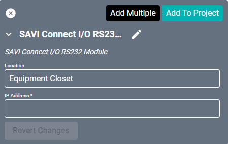
</a>

1. Under **Equipment** in Creator, search for the SAVI Connect I/O RS232 Module.

2. Rename this to the serial module on the Connect I/O (you will need to make one for each of the four RS232 modules).

3. Fill in the IP Address with the static IP you set for the current module.

4. Click Save to add the driver to your project.

#### Custom RS232 Driver
This driver will need to be created first before it can be configured.

<a href="../../../../Assets/Knowledge-Base/Creator/Drivers/new-rs232-driver-01.png">
  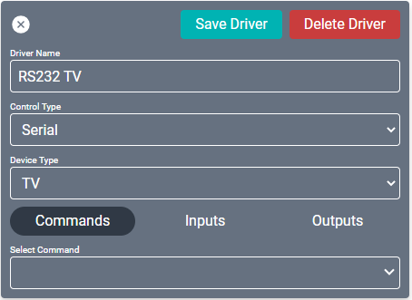
</a>
<a href="../../../../Assets/Knowledge-Base/Creator/Drivers/new-rs232-driver-02.png">
  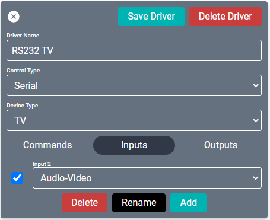
</a>

1. Click the blue **Add Driver** button in the Flexbar.

2. Name the driver the model number of the RS232 device you are connecting to.

3. Set the **Control Type** to Serial and the **Device Type** to TV (Device Type should match what you are connecting to).

4. Under **Commands**, select the command you wish to code and input the **Code** in the feild.
    >***Note: If you do not have the codes, you will need to turn to the serial device manufacturer for that information. Check any documentation you received with the device.***

5. Under **Inputs**, click Add.

6. Select the check box, set the feild to **Audio-Video**, and click **Rename**.

7. Name the input HDMI 1.

8. Click **Add Driver**.

Now that the driver is created, it has been added to the Equipment list with all the other drivers. From here we will continue as if adding any other driver.

<a href="../../../../Assets/Knowledge-Base/Creator/Drivers/example-rs232-driver.png">
  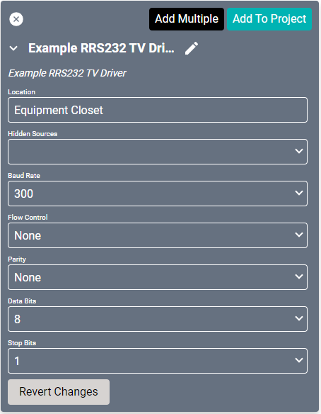
</a>

9. Search for your new driver in the **Add Equipment** section of the Flexbar (remember what you named it in step 2).

10. Name it to reflect the device or location (such as "Bar RS232 1")

11. Change the settings to match the values found in the manufacturer's info. A common configuration is:
    >**Baud Rate:** `9600`
    >**Flow Control:** `Hardware`
    >**Parity:** `None`
    >**Data Bits:** `8`
    >**Stop Bits:** `1`

12. Click **Add to Project**.

#### Connecting Drivers
Now we just need to connect our two drivers together.

<a href="../../../../Assets/Knowledge-Base/Creator/Drivers/example-bar-rs232-driver.png">
  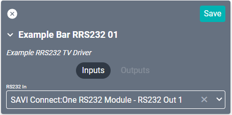
</a>

1. Under **Connections**, search for and select the custom driver you just added to the project (remember to use the name you used in step 10 of the **Custom RS232 Driver** section).

2. Connect the **HDMI 1** to the desired available HDMI source.

3. Connect the **RS232 In** to the Connect I/O port you set up earlier (use the name you created in step 2 of the **Connect I/O Driver** section).

4. Repeat these for each of the custom RS232 drivers you added to the project.
>***Note: Each **Connect I/O Driver** will have four RS232 modules that each require their own driver.***
