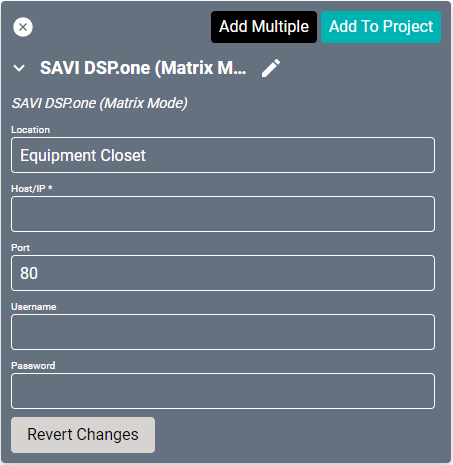
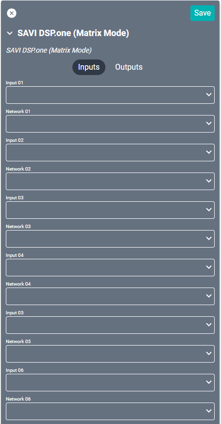
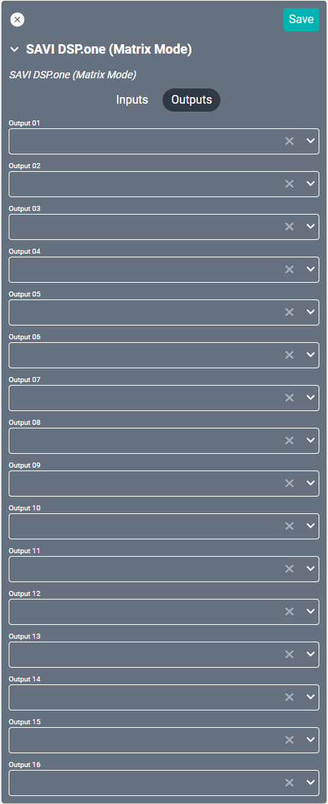
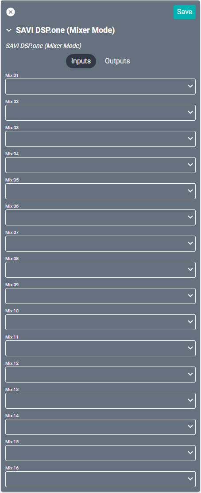
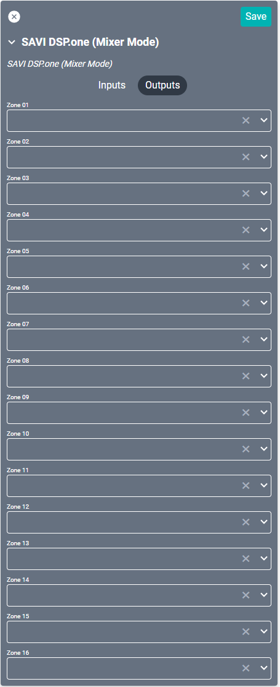

# SAVI DSP Drivers

## Matrix Mode
Matrix mode is the default setting for the DMA.One. Just like a standard matrix switch, Matrix mode directly connects Inputs to one or more Outputs.

#### Properties

* **Name:** Name of the device.

* **Location:** Location of the device within the Project. New Locations can be created by selecting this field, typing in a new name, and then selecting the corresponding "Add New Tag" option or pressing Enter on your keyboard.

* **Host/IP:** The destination IP address that SAVI will use when communicating with the device.

* **Port:** The IP address port that the device is open to. Set to 80 by default.

* **Username:** Login username of the device.

* **Password:** Login password of the device.

### Connections

##### Input

* **Input (01-16):** Supports up to sixteen audio inputs.

##### Output

* **Output (01-16):** Supports up to sixteen audio outputs.

## Mixer Mode
DSP mode unleashes the full potential of a DSP matrix switch, giving you access to mixes and zones for full customizability.

#### Properties

* **Name:** Name of the device.

* **Location:** Location of the device within the Project. New Locations can be created by selecting this field, typing in a new name, and then selecting the corresponding "Add New Tag" option or pressing Enter on your keyboard.

* **Host/IP:** The destination IP address that SAVI will use when communicating with the device.

* **Port:** The IP address port that the device is open to. Set to 80 by default.

* **Username:** Login username of the device.

* **Password:** Login password of the device.

### Connections

##### Input

* **Input (01-16):** Supports up to sixteen audio mixes.

##### Output

* **Output (01-16):** Supports up to sixteen audio zones.
