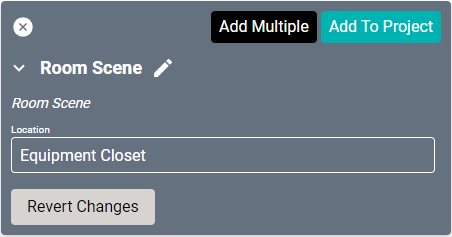

# SAVI Room Scene Driver
This driver creates a scene based off the location set. It is accessible in Facility View in the Switch Scenes menu option.

#### Properties

* **Name:** Name of the device.

* **Location:** Location of the device within the Project. New Locations can be created by selecting this field, typing in a new name, and then selecting the corresponding "Add New Tag" option or pressing Enter on your keyboard.

