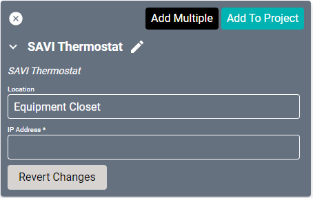

# SAVI Thermostat Driver
Supports the SAVI Thermostat. The Temperature Scale is determined by a global setting in [Creator Server Configuration](/Knowledge-Base/Creator/creator-server-configuration.md) under Settings.

#### Properties

* **Name:** Name of the device.

* **Location:** Location of the device within the Project. New Locations can be created by selecting this field, typing in a new name, and then selecting the corresponding "Add New Tag" option or pressing Enter on your keyboard.

* **IP Address:** The destination IP address that SAVI will use when communicating with the device.
