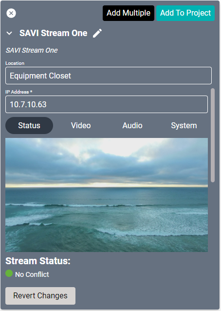
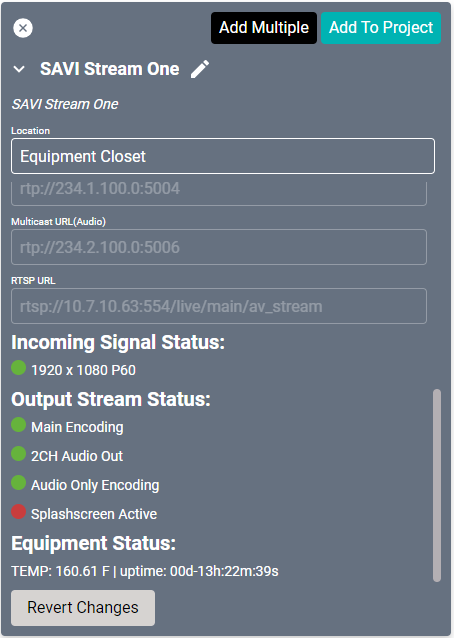
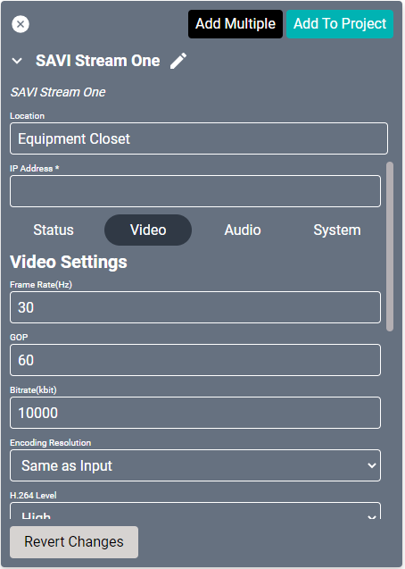
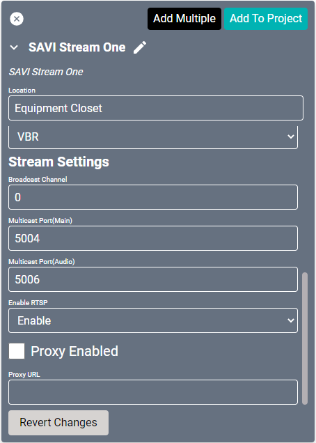
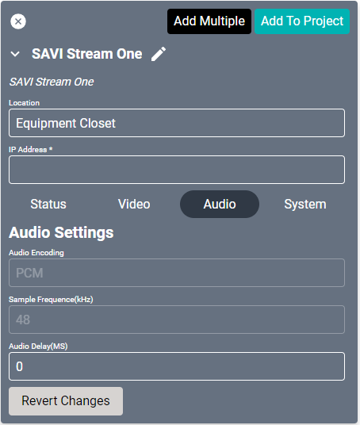
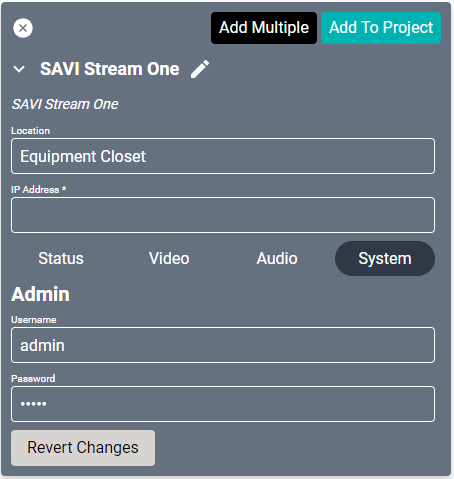
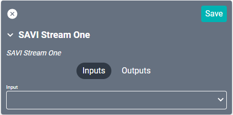
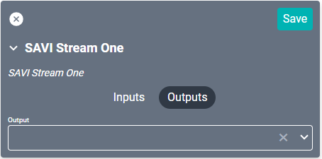

# SAVI Stream.One Driver
Allows complete control and configuration of a SAVI STREAM.One encoder, including live video preview.

#### Properties

* **Name:** Name of the device.

* **Location:** Location of the device within the Project. New Locations can be created by selecting this field, typing in a new name, and then selecting the corresponding "Add New Tag" option or pressing Enter on your keyboard.

* **IP Address:** The destination IP address that SAVI will use when communicating with the device.

#### Status Properties
* **Preview:** Shows a semi-realtime sample of what the connected device is outputting to the Sream.One.

##### Stream Status
* **No Conflict:** Monitors the connection to the Multicast URL to determine if there are multiple Stream.One devices attempting to stream to the same address.

* **Multicast URL(Main):** This is the address that the Stream.One will broadcast on. The number after the colon (:5004 in this example) is the port that is being used on that address. This can be changed under Stream Setting in the Video tab.

* **Multicast URL(Audio):** This is the address and port that only the audio is broadcast on. This separate audio multicast allows directing just audio to speakers and audio zones. This can be changed under Stream Setting in the Video tab.

* **RTSP URL:** The Real Time Streaming Protocol address. This is automatically generated.

##### Incoming Signal Status
* This field indicates the incoming resolution, refresh rate, and audio format.
  * **Green** - Good Input Signal
  * **Red** - No Input Signal or Incompatible Input Signal

##### Output Stream Status
* **Main Encoding:** Displays whether or not the source is active and streaming.
  * **Green** - Streaming
  * **Orange** - Paused, Image Freeze, No Audio
  * **Red** - Stop, No Video or Audio Streaming, Splashscreen Displayed

* **2CH Audio Out:** Displays whether or not the analog Audio output is active (uses the phoenix connectors on the back of the device).
  * **Green** - Audio Present
  * **Red** - Audio Not Present

* **Audio Only Encoding:** Displays whether or not the dedicated Audio stream is active and streaming.
  * **Green** - Streaming
  * **Orange** - Paused, No Audio
  * **Red** - Stop, No Audio Stream

* **Splashscreen Active:** Displays whether or not the splashscreen file is active. This will only be active if Main Encoding is offline.
  * **Green** - Active
  * **Red** - Not active (main encoding is present)

##### Equipment Status
* **TEMP:** The current temperature of the Stream.One device.

* **Uptime:** How long the device has been running since the last power cycle (tracks days, hours, minutes, and seconds).

#### Video Properties

##### Video Setting
* **Frame Rate(Hz):** The frame rate in hertz that the video steams at. This should match the frame rate of the source. Set to 30 as default. Has a range of 5 to 60.

* **GOP:** The Group Of Pictures field determines the distance between iFrames in the video encoding. Set to 60 as default. Has a range of 5 to 300.

* **Bitrate(kbit):** The number of kilobits processed per second. Set to 10000 as default. Has a range of 32 to 32000. In CBR mode, this will set the bitrate. In VBR mode, this will set the upper limit of the bitrate.

* **Encoding Resolution:** The resolution the Stream.One will broadcast as. This can be set as Same as Input (ie, whatever resolution your source is) or as either 1080p, 720p, or 480p.

* **H.264 Level:** The quality of the encoding stream.
  * **Baseline** - Lowest Encoding, Lowest Processing Power Required
  * **Main** - Higher Quality
  * **High** - HD Quality

* **Bitrate Control:** Changes between Variable Bit Rate (VBR) and Constant Bit Rate (CBR). VBR is default.

##### Stream Setting

* **Broadcast Channel:** This impacts the Main and Audio Address for streaming. This is set to 0 as default. Range 0 to 999. Recommended to set this to >0 in the event of a Factory Reset.

* **Multicast Port(Main):** This sets the port on the address to broadcast the source audio and video. 5004 by default.

* **Multicast Port(Audio):** This sets the port on the address to broadcast the dedicated audio. 5006 by default.

* **Enable RTSP:** This will enable or disable streaming on the RTSP URL.

* **Proxy Enable:** Enabling this will use the Proxy URL in place of the RTP stream.

* **Proxy URL:** URL address of the proxy stream.

#### Audio Properties

* **Audio Encoding:** Fixed to PCM (Pulse-code modulation).

* **Sample Frequence(kHz):** Fixed at 48kHz.

* **Audio Delay(MS):** Sets how much of a delay (in milliseconds) to put before the audio to sync it to the video. Defaulted to 0. Range 0 to 1500 in increments of 20.

#### System Properties

<!--

-->

##### Admin
* **Username:** Input the Username used on the Stream.One. This cannot be changed here, it must be changed in the Stream.One UI.

* **Password:** Input the Password used on the Stream.One. This cannot be changed here, it must be changed in the Stream.One UI.

<!--
##### Configuration
* **Download Configuration:** Saves the configuration settings for this Stream.One as a .json file on your current device. Helpful if you have multiple Stream.Ones with very similar but custom configurations.

* **Upload Configuration:** Allows selecting a backed-up configuration file to upload.
>Will allow "Ignore Network and Channel Settings" to make replicating settings easier.

* **Submit:** Applies settings that were uploaded.

##### Splashscreen Update
* **Choose File:** Upload an image file to be used as a splashscreen when there is no source data. Only supports JPEG(.jpg) file formats under 500kb size with a resolution of 1920 x 1080 or less.

* **Update:** Applies the selected file as the current Splashscreen.

##### Firmware Update
* **Choose File:** Upload a firmware file to be installed to the Stream.One.

* **Submit:** Installs the firmware that was uploaded.

* **Menu Button:** Enable or disable the physical Front Panel Menu Button on the device. Enabled by default.

* **Stream Button:** Enable or disable the physical Front Panel Stream Button on the device. Enabled by default.

##### Reboot/Factory Reset
* **Reboot:** Performs a soft Power Cycle of the Stream.One.

* **Factory Reset:** Resets all settings and fields to Factory defaults.
-->

### Connections

##### Input

* **Input:** Connects to any audio and/or video device physically for streaming. Commonly connected to Cable TV boxes and media players (DVDs, Bluetooth, etc.,).

##### Output

* **Output:** A through pass for the input. This is commonly used for connecting a small monitor for observing the input device.
