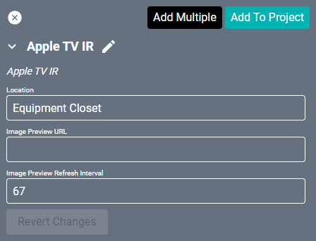
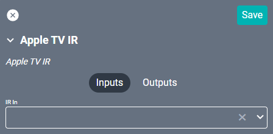
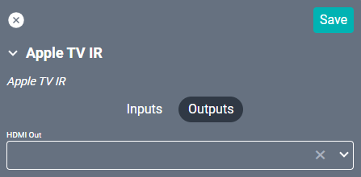

# AppleTV IR Driver

This driver allows control of AppleTVs through IR.

#### Properties

* **Name:** Name of the device.

* **Location:** Location of the device within the Project. New Locations can be created by selecting this field, typing in a new name, and then selecting the corresponding "Add New Tag" option or pressing Enter on your keyboard.

* **Image Preview URL:** This field will auto generate a snapshot image URL when connected to a Stream.One.

* **Image Preview Refresh Interval:** This will set how often Creator should refresh (reload) the Preview Image. By default this is set to 67ms.

### Connections

#### Input

* **IR In:** The IR connection.

#### Output

* **HDMI Out:** The equipment that the AppleTV is connected to. This can be a display, an audio/video mixer, a Stream.One, etc.
