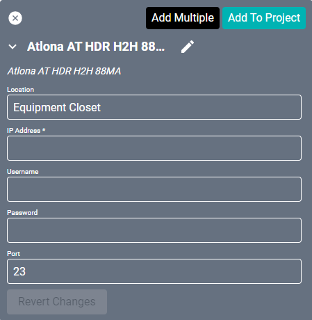
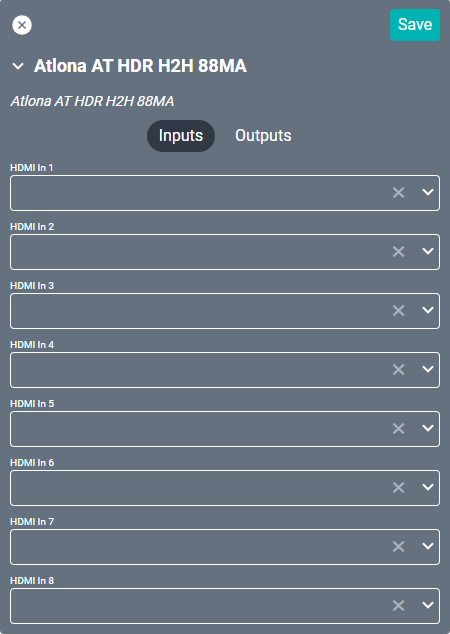
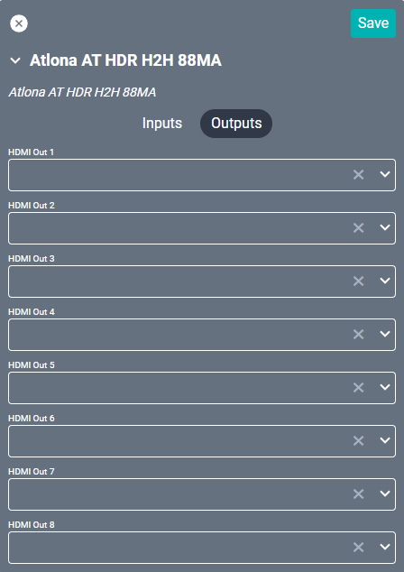

# Atlona AT HDR H2H 88MA Driver
This driver interfaces with this specific [Atlona video matrix](https://atlona.com/product/at-hdr-h2h-88ma/ "Atlona video matrix"). Specifications on the matrix itself can be found on the Atlona site.

#### Properties

* **Name:** Name of the device.

* **Location:** Location of the device within the Project. New Locations can be created by selecting this field, typing in a new name, and then selecting the corresponding "Add New Tag" option or pressing Enter on your keyboard.

* **IP Address:** The destination IP address that SAVI will use when communicating with the device.

* **Username:** Login username of the device.

* **Password:** Login password of the device.

* **Port:** The IP address port that the device is open to. Set to 23 by default.

### Connections

##### Input

* **HDMI (1-8):** Corresponds to the HDMI inputs on the back of the device.

##### Output

* **HDMI Out (1-8):** Corresponds to the HDMI outputs on the back of the device.
