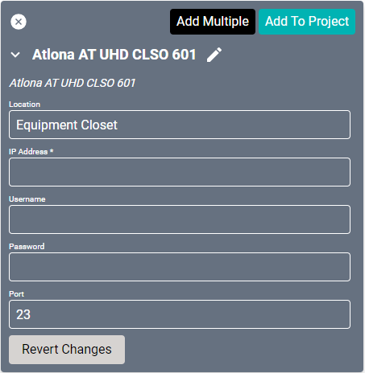
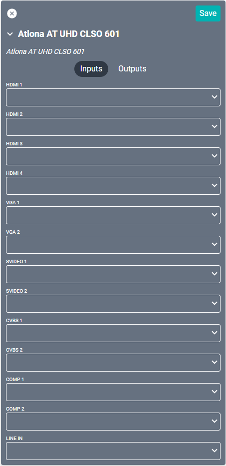
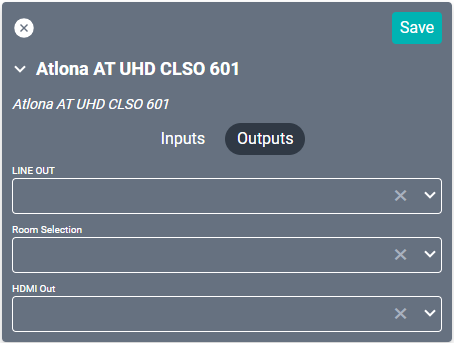

# Atlona AT-UHD-CLSO-601 Driver
This driver interfaces with this specific [Atlona video matrix](https://atlona.com/product/at-uhd-clso-601/ "Atlona video matrix"). Specifications on the matrix itself can be found on the Atlona site.

#### Properties

* **Name:** Name of the device.

* **Location:** Location of the device within the Project. New Locations can be created by selecting this field, typing in a new name, and then selecting the corresponding "Add New Tag" option or pressing Enter on your keyboard.

* **IP Address:** The destination IP address that SAVI will use when communicating with the device.

* **Username:** Login username of the device.

* **Password:** Login password of the device.

* **Port:** The IP address port that the device is open to. Set to 23 by default.

### Connections

##### Input

* **HDMI (1-4):** Corresponds to the four HDMI inputs on the back of the device. Can pair with audio input from matching labeled 3-pos euroblock audio inputs.

* **VGA (1-2):** Corresponds to the two VGA inputs on the back of the device (15pin blue connectors). Used for SD computer displays. Pairs with audio input from matching RS232 or L/R audio 3-pos euroblock audio inputs.

* **SVIDEO (1-2):** Corresponds to the two VGA inputs on the back of the device (15pin blue connectors). Compatible with S-Video signals. Pairs with audio input from matching RS232 or L/R audio 3-pos euroblock audio inputs.

* **CVBS (1-2):** Corresponds to the two VGA inputs on the back of the device (15pin blue connectors). Compatible with composite signals. Pairs with audio input from matching RS232 or L/R audio 3-pos euroblock audio inputs.

* **COMP (1-2):** Corresponds to the two VGA inputs on the back of the device (15pin blue connectors). Compatible with component signals. Pairs with audio input from matching RS232 or L/R audio 3-pos euroblock audio inputs.

* **LINE IN:** 3-pos euroblock audio input used for plain Line-in or MIC input.
>***Be sure to select MIC (self-powered), 48V (supplies 48V to MIC), or LINE (balanced, unbalanced, mono, or two channel) for the appropriate audio source.***

##### Output

* **LINE OUT:** RJ45 output for use with AT-UHD-EX-100CE-RX HDBaseT device.

* **Room Selection:** A deprecated output. Not recommended for use.

* **HDMI Out:** Corresponds to the HDMI output on the back of the device.
