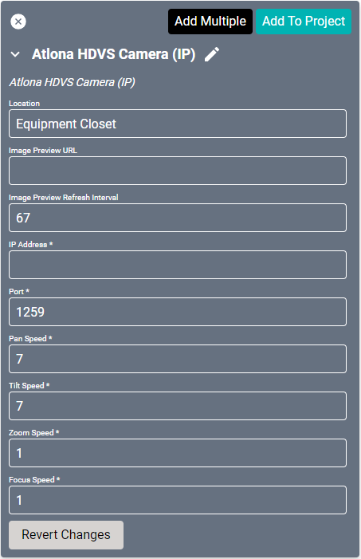
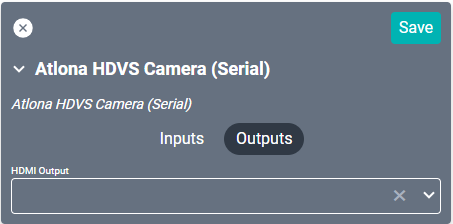
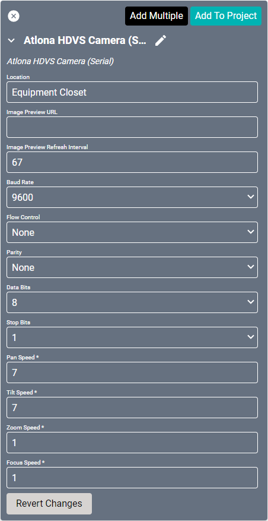
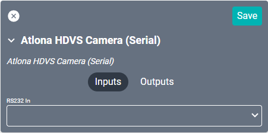

# Atlona Camera Drivers
These drivers interface with the [Atlona HDVS Camera](https://atlona.com/product/hdvs-cam/ "Atlona HDVS Camera") through either IP or Serial connection. Specifications on the camera itself can be found on the Atlona site.

## HDVS Camera (IP)

#### Properties

* **Name:** Name of the device.

* **Location:** Location of the device within the Project. New Locations can be created by selecting this field, typing in a new name, and then selecting the corresponding "Add New Tag" option or pressing Enter on your keyboard.

* **Image Preview URL:** A link used to preview a streaming video source. If the driver is connected to a Stream.One, this field will auto-populate. This provides the appropriate URL to SAVI Preview in Facility View. Allowable: single image preview or Motion JPEG.

* **Image Preview Refresh Interval:** Determines how often the preview image should be refreshed. Specifies Refresh Interval in Milliseconds (default is 67 which is equal to 15 frames per second).

* **IP Address:** The destination IP address that SAVI will use when communicating with the device.

* **Port:** The IP address port that the device is open to. Set to 1259 by default.

* **Pan Speed:** Speed the camera will pan (left and right) at 1 (low) - 24 (high). Set to 7 by default.

* **Tilt Speed:** Speed the camera will tilt (up and down) at 1 (low) - 20 (high). Set to 7 by default.

* **Zoom Speed:** Speed the camera will zoom at 0 (low) - 16 (high). Set to 1 by default.
* **Focus Speed:** Speed the camera will focus at 0 (low) - 16 (high). Set to 1 by default.

### Connections

##### Output

* **HDMI Out:** Corresponds to the HDMI output on the back of the camera.

----

## HDVS Camera (Serial)

#### Properties

* **Name:** Name of the device.

* **Location:** Location of the device within the Project. New Locations can be created by selecting this field, typing in a new name, and then selecting the corresponding "Add New Tag" option or pressing Enter on your keyboard.

* **Image Preview URL:** A link used to preview a streaming video source. If the driver is connected to a Stream.One, this field will auto-populate. This provides the appropriate URL to SAVI Preview in Facility View. Allowable: single image preview or Motion JPEG.

* **Image Preview Refresh Interval:** Determines  how often the preview image should be refreshed. Specifies Refresh Interval in Milliseconds (default is 67 which is equal to 15 frames per second).

* **Baud Rate:** Set to 9600 by default.

* **Flow Control:** Sets the serial port handshake type.
  * **None** - Turned off.
  * **Hardware** - Hardware flow control.
  * **XON/XOFF** - Software flow control.
  * **Unknown** - Flow control is unknown.

* **Parity:** Sets the serial port parity type for error detecting.
  * **None** - Turned off.
  * **Even** - Even parity bit.
  * **Odd** - Odd parity bit.
  * **Unknown** - Parity is unknown.

* **Data Bits:** Set to 8.

* **Stop Bits:** Set to either 1 or 2.

* **Pan Speed:** Speed the camera will pan (left and right) at 1 (low) - 24 (high). Set to 7 by default.

* **Tilt Speed:** Speed the camera will tilt (up and down) at 1 (low) - 20 (high). Set to 7 by default.

* **Zoom Speed:** Speed the camera will zoom at 0 (low) - 16 (high). Set to 1 by default.

* **Focus Speed:** Speed the camera will focus at 0 (low) - 16 (high). Set to 1 by default.

### Connections

##### Input

* **RS232 In:** Serial input for control.

##### Output

* **HDMI Output:** Corresponds to the HDMI output on the back of the camera.
