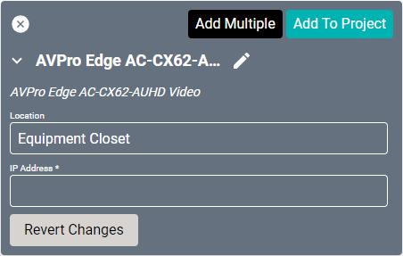
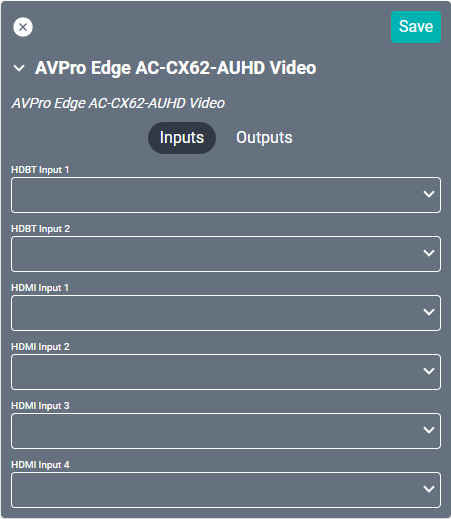
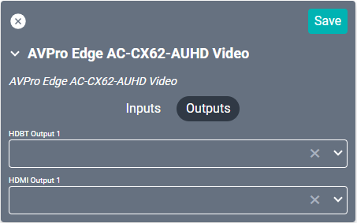
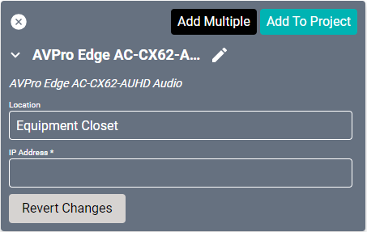
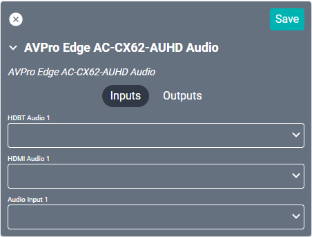
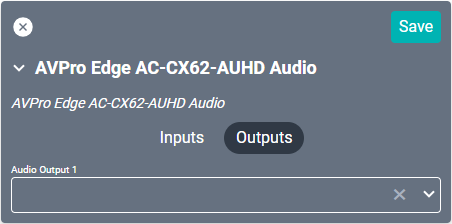

# AVPro Edge AC-CX62-AUHD Drivers
These AVPro Edge line of drivers provide amplifier audio and switch control for the [AC-CX62-AUHD](https://www.avproedge.com/ac-cx62-auhd.html "AC-CX62-AUHD") device. This is an 18Gbps 6x2 matrix switcher utilizing both HDMI and HDBaseT inputs and outputs. The drivers for this device are split into an Audio and Video driver. Both must be configured to enable full functionality.

### Video Driver Properties

* **Name:** Name of the device.

* **Location:** Location of the device within the Project. New Locations can be created by selecting this field, typing in a new name, and then selecting the corresponding "Add New Tag" option or pressing Enter on your keyboard.

* **IP Address:** The destination IP address that SAVI will use when communicating with the device.

### Video Connections

##### Input

* **HDBaseT Input 1:** Connect an HDBaseT source.

* **HDMI Input (1-3):** Connect to up to 3 individual sources.

##### Output

* **HDBaseT Output 1:** Ethernet connection to individual display or HDBaseT converter.

* **HDMI Output 1:** Video output.

### Audio Driver Properties

* **Name:** Name of the device.

* **Location:** Location of the device within the Project. New Locations can be created by selecting this field, typing in a new name, and then selecting the corresponding "Add New Tag" option or pressing Enter on your keyboard.

* **IP Address:** The destination IP address that SAVI will use when communicating with the device.

### Audio Connections

##### Input

* **HDBaseT Input 1:** Connect an HDBaseT source.

* **HDMI Input 1:** Connect an HDMI source.

* **Audio Input 1:** 3-pin euroblock (phoenix) connection.

##### Output

* **HDMI Output 1:** Audio output.
