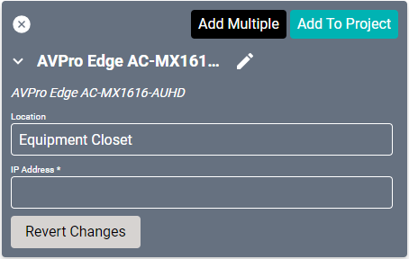
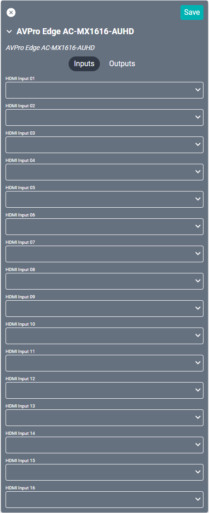
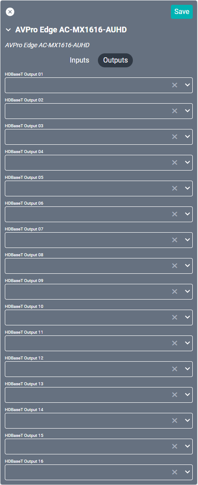

# AVPro Edge AC-MX1616 AUHD Driver
These AVPro Edge line of drivers provide amplifier audio control for the [AC-MX1616-AUHD-HDBT-AVDM](https://www.avproedge.com/ac-mx1616-auhd-hdbt-avdm.html "AC-MX1616-AUHD-HDBT-AVDM") device. This is an 18Gbps 16x16 matrix switcher utilizing both HDMI and HDBaseT inputs and outputs. The drivers for this device are split into an Audio and Video driver. Both must be configured to enable full functionality.

#### Properties

* **Name:** Name of the device.

* **Location:** Location of the device within the Project. New Locations can be created by selecting this field, typing in a new name, and then selecting the corresponding "Add New Tag" option or pressing Enter on your keyboard.

* **IP Address:** The destination IP address that SAVI will use when communicating with the device.

### Connections

##### Input

* **HDMI Input (1-16):** Connect to up to 16 individual sources.

##### Output

* **HDBaseT Output (1-16):** Ethernet connections to up to 16 individual displays or HDBaseT converters.
