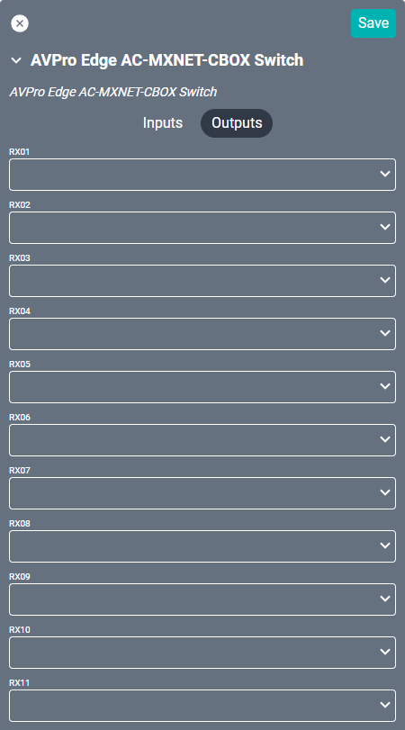

# AVPro Edge AC-MXNET-CBOX Switch Driver
This AVPro Edge driver interfaces with the [CBOX switch](https://www.avproedge.com/ac-mxnet-cbox.html) device, which in turn controls multi-cast switches, receivers, and transmitters. 

#### Properties

* **Name:** Name of the device.

* **Location:** Location of the device within the Project. New Locations can be created by selecting this field, typing in a new name, and then selecting the corresponding "Add New Tag" option or pressing Enter on your keyboard.

* **IP Address:** The destination IP address that SAVI will use when communicating with the device.

* **TX(01-24) ID:** Transmitter port ID.

* **RX(01-24) ID:** Receiver port ID.

### Connections

##### Input

* **TX(01-24):** Connects to up to 24 individual source transmitters.

##### Output

* **RX(01-24):** Connects to up to 24 individual output receivers.