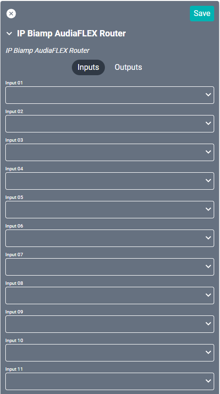

# Biamp AudiaFLEX Drivers

These drivers directly interact with [biamp AudiaFLEX](https://support.biamp.com/Audia-Nexia) hardware to control source selection and volume control with SAVI. There are four separate drivers for this device, but not all are utilized at the same time. One driver is needed for volume control and another for source selection.

## IP Drivers
### IP Biamp AudiaFLEX Control
This driver is used for volume control.

#### Properties

* **Name:** Name of the device.

* **Location:** Location of the device within the Project. New Locations can be created by selecting this field, typing in a new name, and then selecting the corresponding "Add New Tag" option or pressing Enter on your keyboard.

* **IP Address:** The destination IP address that SAVI will use when communicating with the device.

* **Port:** The IP address port that the device is open to. Set to 23 by default.

* **Device Number:** Determines the position of the unit in a chain of up to 15. Set to 1 by default.

* **Instance ID:** The Device ID/Instance Tag of the processing block.

* **Minimum decibel range:** Minimum decibels allowed. Set to -100 by default.

* **Maximum decibel range:** Maximum decibels allowed. Set to 12 by default.

### Connections
If using this driver as an Alternate Volume Control, leave all connections blank.

##### Input

* **Input (1-50):** Supports up to fifty audio inputs depending on device. Is still limited by the logical ports within the biamp system.

##### Output

* **Output (1-50):** Supports up to fifty audio outputs depending on device. Is still limited by the logical ports within the biamp system.

### IP Biamp AudiaFLEX Router
This driver is used for source selection.

#### Properties

* **Name:** Name of the device.

* **Location:** Location of the device within the Project. New Locations can be created by selecting this field, typing in a new name, and then selecting the corresponding "Add New Tag" option or pressing Enter on your keyboard.

* **IP Address:** The destination IP address that SAVI will use when communicating with the device.

* **Port:** The IP address port that the device is open to. Set to 23 by default.

* **Device Number:** Determines the position of the unit in a chain of up to 15. Set to 1 by default.

* **Instance ID:** The Device ID/Instance Tag of the processing block.

### Connections

##### Input

* **Input (1-50):** Supports up to fifty audio inputs depending on device. Is still limited by the logical ports within the biamp system.

##### Output

* **Output (1-50):** Supports up to fifty audio outputs depending on device. Is still limited by the logical ports within the biamp system.

----

## Serial Drivers
### Serial Biamp AudiaFLEX Control
This driver is used for volume control.

#### Properties

* **Name:** Name of the device.

* **Location:** Location of the device within the Project. New Locations can be created by selecting this field, typing in a new name, and then selecting the corresponding "Add New Tag" option or pressing Enter on your keyboard.

* **Baud Rate:** Set to 38400 by default.

* **Flow Control:** Sets the serial port handshake type.
  * None - Turned off.
  * Hardware - Hardware flow control.
  * XON/XOFF - Software flow control.
  * Unknown - Flow control is unknown.

* **Parity:** Sets the serial port parity type for error detection.
  * None - Turned off.
  * Even - Even parity bit.
  * Odd - Odd parity bit.
  * Unknown - Parity is unknown.

* **Data Bits:** Set to 8.

* **Stop Bits:** Set to either 1 or 2.

* **Device Number:** Determines the position of the unit in a chain of up to 15. Set to 1 by default.

* **Instance ID:** The Device ID/Instance Tag of the processing block.

* **Device Number:** Determines the position of the unit in a chain of up to 15. Set to 1 by default.

* **Instance ID:** The Device ID/Instance Tag of the processing block.

* **Minimum decibel range:** Minimum decibels allowed. Set to -100 by default.

* **Maximum decibel range:** Maximum decibels allowed. Set to 12 by default.

### Connections

##### Input

* **Input (1-50):** Supports up to fifty audio inputs depending on device. Is still limited by the logical ports within the biamp system.

##### Output

* **Output (1-50):** Supports up to fifty audio outputs depending on device. Is still limited by the logical ports within the biamp system.

### Serial Biamp AudiaFLEX Router
This driver is used for source selection.

#### Properties

* **Name:** Name of the device.

* **Location:** Location of the device within the Project. New Locations can be created by selecting this field, typing in a new name, and then selecting the corresponding "Add New Tag" option or pressing Enter on your keyboard.

* **Baud Rate:** Set to 38400 by default.

* **Flow Control:** Sets the serial port handshake type.
  * None - Turned off.
  * Hardware - Hardware flow control.
  * XON/XOFF - Software flow control.
  * Unknown - Flow control is unknown.

* **Parity:** Sets the serial port parity type for error detection.
  * None - Turned off.
  * Even - Even parity bit.
  * Odd - Odd parity bit.
  * Unknown - Parity is unknown.

* **Data Bits:** Set to 8.

* **Stop Bits:** Set to either 1 or 2.

* **Device Number:** Determines the position of the unit in a chain of up to 15. Set to 1 by default.

* **Instance ID:** The Device ID/Instance Tag of the processing block.

### Connections

##### Input

* **Input (1-50):** Supports up to fifty audio inputs depending on device. Is still limited by the logical ports within the biamp system.

##### Output

* **Output (1-50):** Supports up to fifty audio outputs depending on device. Is still limited by the logical ports within the biamp system.
