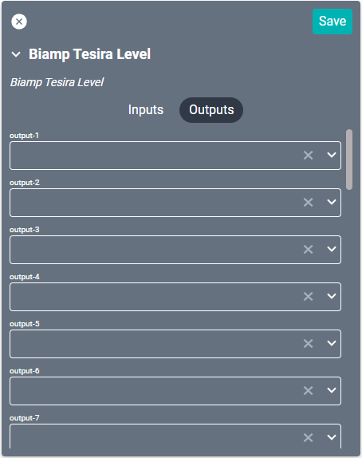

# Biamp Tesira Drivers

These drivers directly interact with the [Biamp Tesira line](https://www.biamp.com/products/product-families/tesira) of hardware and configured software to control source selection and volume control with SAVI. There are four separate drivers for this device, but not all are utilized at the same time. One driver is needed for volume control and another for source selection.

### Tesira Level
The level driver controls minimum and maximum volume range as well as how the volume scale is displayed.

You will also need to set this driver as the **Alternate Volume Control** in the **Audio Zone** driver.

#### Properties

* **Name:** Name of the device.

* **Location:** Location of the device within the Project. New Locations can be created by selecting this field, typing in a new name, and then selecting the corresponding "Add New Tag" option or pressing Enter on your keyboard.

* **Instance Tag:** The Instance ID/Device ID of the processing block.

* **IP Address:** The destination IP address that SAVI will use when communicating with the device.

* **Username:** Login username of the device.

* **Password:** Login password of the device.

* **Volume Scale:** How the volume is displayed.
  * dB - In decibels.
  * Percentage - 0 to 100 percent.

* **Max dB:** Maximum decibels allowed. Set to 12 by default.

* **Min dB:** Minimum decibels allowed. Set to -100 by default.

* **Mute Type:** Select how mute functions.
  * Mute - Completely mutes the audio channel.
  * Level - Utilizes the **Mute Level** to set an audio channel to a specific volume.

* **Mute Level:** What to set volume to when muting by level. Set to -100 by default.

### Connections
If using this driver as an Alternate Volume Control, leave all connections blank.

##### Input

* **Input (1-36):** Supports up to thirty-six audio inputs depending on device. Is still limited by the logical ports within the biamp system.

##### Output

* **Output (1-36):** Supports up to thirty-six audio outputs depending on device. Is still limited by the logical ports within the biamp system.

------------

## Source Selection

The Matrix Mixer, Router Block, and Source Selector are different drivers that each complete roughly the same function. The driver you use is determined by the biamp UI configuration. Choose **one** of these drivers to complete your source selection within SAVI.

### Tesira Matrix Mixer
#### Properties

* **Name:** Name of the device.

* **Location:** Location of the device within the Project. New Locations can be created by selecting this field, typing in a new name, and then selecting the corresponding "Add New Tag" option or pressing Enter on your keyboard.

* **Instance Tag:** The Instance ID/Device ID of the processing block. Created within the biamp software.

* **IP Address:** The destination IP address that SAVI will use when communicating with the device.

* **Username:** Login username of the device.

* **Password:** Login password of the device.

* **Use Crosspoint Levels:** Determines if volume can be adjusted at the crosspoint.
  * Yes - Enable crosspoint levels.
  * No - Disable crosspoint levels.

* **Volume Scale:** How the volume is displayed.
  * dB - In decibels.
  * Percentage - 0 to 100 percent.

* **Output (1-36) Max dB:** Maximum decibels allowed. Set to 12 by default.

* **Output (1-36) Min dB:** Minimum decibels allowed. Set to -100 by default.

* **Mute Type:** Select how mute functions.
  * Mute - Completely mutes the audio channel.
  * Level - Utilizes the **Mute Level** to set an audio channel to a specific volume.

* **Mute Level:** What to set volume to when muting by level. Set to -100 by default.

### Connections

##### Input

* **Input (1-36):** Supports up to thirty-six audio inputs depending on device. Is still limited by the logical ports within the biamp system.

##### Output

* **Output (1-36):** Supports up to thirty-six audio outputs depending on device. Is still limited by the logical ports within the biamp system.

### Tesira Router Block
#### Properties

* **Name:** Name of the device.

* **Location:** Location of the device within the Project. New Locations can be created by selecting this field, typing in a new name, and then selecting the corresponding "Add New Tag" option or pressing Enter on your keyboard.

* **Instance Tag:** The Instance ID/Device ID of the processing block. Created within the biamp software.

* **IP Address:** The destination IP address that SAVI will use when communicating with the device.

* **Username:** Login username of the device.

* **Password:** Login password of the device.

#### Connections

##### Input

* **Input (1-50):** Supports up to fifty audio inputs depending on device. Is still limited by the logical ports within the biamp system.

##### Output

* **Output (1-50):** Supports up to fifty audio outputs depending on device. Is still limited by the logical ports within the biamp system.

### Tesira Source Selector
#### Properties

* **Name:** Name of the device.

* **Location:** Location of the device within the Project. New Locations can be created by selecting this field, typing in a new name, and then selecting the corresponding "Add New Tag" option or pressing Enter on your keyboard.

* **Instance Tag:** The Instance ID/Device ID of the processing block. Created within the biamp software.

* **IP Address:** The destination IP address that SAVI will use when communicating with the device.

* **Username:** Login username of the device.

* **Password:** Login password of the device.

* **Volume Scale:** How the volume is displayed.
  * dB - In decibels.
  * Percentage - 0 to 100 percent.

* **Output Max dB:** Maximum decibels allowed. Set to 12 by default.

* **Output Min dB:** Minimum decibels allowed. Set to -100 by default.

* **Source (1-32) Max dB:** Maximum decibels allowed. Set to 12 by default.

* **Source (1-32) Min dB:** Minimum decibels allowed. Set to -100 by default.

#### Connections

##### Input

* **Input (1-36):** Supports up to thrity-six audio inputs, depending on device. Is still limited by the logical ports within the biamp system.

##### Output

* **Output:** Connects to the Audio Zone associated with the Sourse Selector device.
