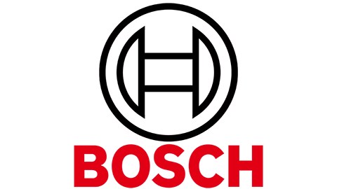
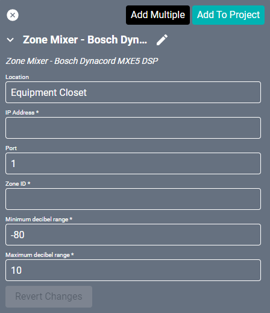
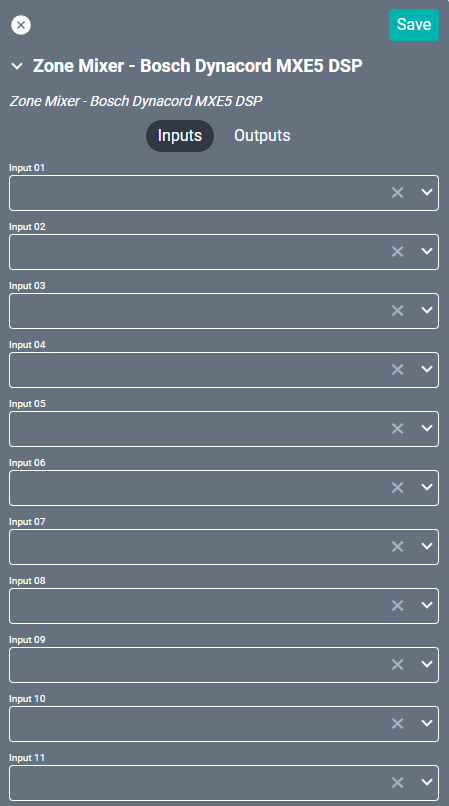
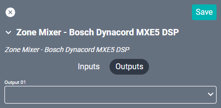

# Bosch Dynacord MXE5 Driver
This driver allows control over source selection and volume on the [MXE5 Matrix mix engine](https://products.dynacord.com/na/en/mxe5/) through the Sonicue software. This driver represents the virtual mixer within that software and is connected to only one output. Add a new Zone Mixer driver for each output.

#### Properties

* **Name:** Name of the device.

* **Location:** Location of the device within the Project. New Locations can be created by selecting this field, typing in a new name, and then selecting the corresponding "Add New Tag" option or pressing Enter on your keyboard.

* **IP Address:** The destination IP address that SAVI will use when communicating with the device.

* **Zone ID:** This refers to the setting of the same name within the Sonicue software.

* **Minimum decibel range:** Minimum decibels allowed. Set to -80 by default.

* **Maximum decibel range:** Maximum decibels allowed. Set to 10 by default.

### Connections

##### Input

* **Input (01-24):** Up to twenty-four audio inputs included in this mix.

##### Output

* **Output 01:** One of the audio outputs.
