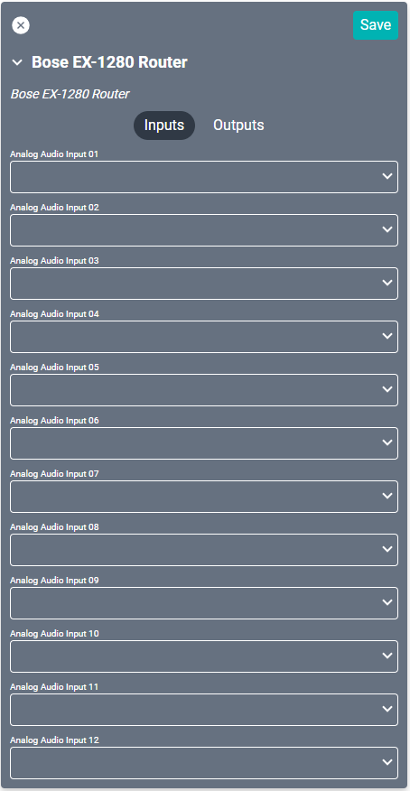

# Bose EX-1280 Drivers
There are six separate drivers for this device, but not all are utilized at the same time. One driver is needed for volume control and another for source selection. The configuration of the EX-1280 will determine which drivers you use. See the [device page](https://pro.bose.com/en_us/products/signal_processing_and_networking/controlspace_ex/cs_ex_1280.html "device page") for further information regarding Bose setup.

## Volume Control
Whichever driver you chose to use, you will not need to set up connections for them. You will need to set that driver as the **Alternate Volume Control** in the **Audio Zone** driver.

### Gain Driver
#### Properties

* **Name:** Name of the device.

* **Location:** Location of the device within the Project. New Locations can be created by selecting this field, typing in a new name, and then selecting the corresponding "Add New Tag" option or pressing Enter on your keyboard.

* **Name of gain module:** Name includes the id (ie "Gain 1" or "Main Volume").

* **IP Address:** The destination IP address that SAVI will use when communicating with the device.

* **Has Discrete Volume:** This is always enabled.

### Connections

##### Input

* **Analog Audio Input (01-12):** Do not use. These are listed for selecting specific ports for Alternate Volume Control and Corresponds to the ports on the device.
    >May cause issues if connected to inputs while connected to anther switch.

##### Output

* **Analog Audio Output 01:** Do not use. These are listed for selecting specific ports for Alternate Volume Control and Corresponds to the ports on the device.
  >May cause issues if connected to inputs while connected to anther switch.

### Output Driver
#### Properties

* **Name:** Name of the device.

* **Location:** Location of the device within the Project. New Locations can be created by selecting this field, typing in a new name, and then selecting the corresponding "Add New Tag" option or pressing Enter on your keyboard.

* **Name of output module:** Name includes the id (ie "Output 1" or "Main L").

* **IP Address:** The destination IP address that SAVI will use when communicating with the device.

* **Has Discrete Volume:** This is always enabled.

### Connections

##### Input

* **Analog Audio Input 01:** Do not use. These are listed for selecting specific ports for Alternate Volume Control and Corresponds to the ports on the device.
  >May cause issues if connected to inputs while connected to anther switch.

##### Output

* **Analog Audio Output 01:** Do not use. These are listed for selecting specific ports for Alternate Volume Control and Corresponds to the ports on the device.
  >May cause issues if connected to inputs while connected to anther switch.

------------

## Source Selection
The driver used here is dependent on how the DSP is configured in the Bose virtual project.

### Router Driver
This is the typical driver chosen for source selection. However, if the DSP is configured without a router, then you will need to use one of the other drivers below.

#### Properties

* **Name:** Name of the device.

* **Location:** Location of the device within the Project. New Locations can be created by selecting this field, typing in a new name, and then selecting the corresponding "Add New Tag" option or pressing Enter on your keyboard.

* **Name of router module:** Name includes the id (ie "Router 1" or "Select").

* **IP Address:** The destination IP address that SAVI will use when communicating with the device.

### Connections

##### Input

* **Analog Audio Input (01-12):** Up to twelve line-in audio sources, using euroblock (phoenix) connectors.

##### Output

* **Analog Audio Output (01-08):** Up to eight audio outputs, using euroblock (phoenix) connectors.

### Matrix Mixer Driver
#### Properties

* **Name:** Name of the device.

* **Location:** Location of the device within the Project. New Locations can be created by selecting this field, typing in a new name, and then selecting the corresponding "Add New Tag" option or pressing Enter on your keyboard.

* **Name of matrix mixer module:** Name includes the id (ie "Matrix 1" or "My Matrix").

* **Number of outputs:** This is important for determining cross points. This must match the number of outputs in the corresponding virtual module from the DSP project.

* **IP Address:** The destination IP address that SAVI will use when communicating with the device.

### Connections

##### Input

* **Analog Audio Input (01-12):** Up to twelve line-in audio sources, using euroblock (phoenix) connectors.

##### Output

* **Analog Audio Output (01-08):** Up to eight audio outputs, using euroblock (phoenix) connectors.
  >***Do not use any outputs beyond the entered number of outputs in Properties.***

### Source Selector Driver
#### Properties

* **Name:** Name of the device.

* **Location:** Location of the device within the Project. New Locations can be created by selecting this field, typing in a new name, and then selecting the corresponding "Add New Tag" option or pressing Enter on your keyboard.

* **Name of selector module:** Name includes the id (ie "Selector 1" or "Bar"). This must match the name in the corresponding virtual module from the DSP project.

* **IP Address:** The destination IP address that SAVI will use when communicating with the device.

### Connections

##### Input

* **Analog Audio Input (01-12):** Up to twelve line-in audio sources, using euroblock (phoenix) connectors.

##### Output

* **Analog Audio Output 01:** Audio zone output.

### Standard Mixer Driver
#### Properties

* **Name:** Name of the device.

* **Location:** Location of the device within the Project. New Locations can be created by selecting this field, typing in a new name, and then selecting the corresponding "Add New Tag" option or pressing Enter on your keyboard.

* **Name of standard mixer module:** Name includes the id (ie "StdMixer 1" or "Mix"). This must match the name in the corrisponding virtual moduel from the DSP project.

* **IP Address:** The destination IP address that SAVI will use when communicating with the device.

### Connections

##### Input

* **Analog Audio Input (01-12):** Up to twelve line-in audio sources, using euroblock (phoenix) connectors.

##### Output

* **Analog Audio Output (01-08):** Up to eight audio outputs, using euroblock (phoenix) connectors.
