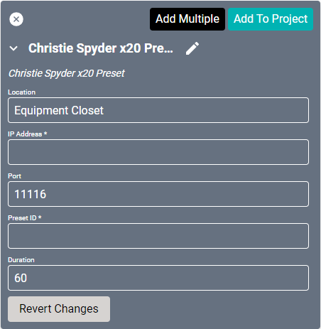

# Spyder X20 Driver
This driver is unique in that it does not add a driver controller to Equipment or Connections. It instead creates a Macro for changing presets on the [device](https://www.christiedigital.com/products/image-processors/christie-spyder-x20/overview). The macro will still need to be configured under the Macros section of Creator.

#### Properties

* **Name:** Name of the device.

* **Location:** Location of the device within the Project. New Locations can be created by selecting this field, typing in a new name, and then selecting the corresponding "Add New Tag" option or pressing Enter on your keyboard.

* **IP Address:** The destination IP address that SAVI will use when communicating with the device.

* **Port:** The IP address port that the device is open to. Set to 11116 by default.

* **Preset ID:** The unique identifier of the preset you wish to control.

* **Duration:** Choose how long (in seconds) an image/video shows before transitioning to the next. Set to 60 by default.
