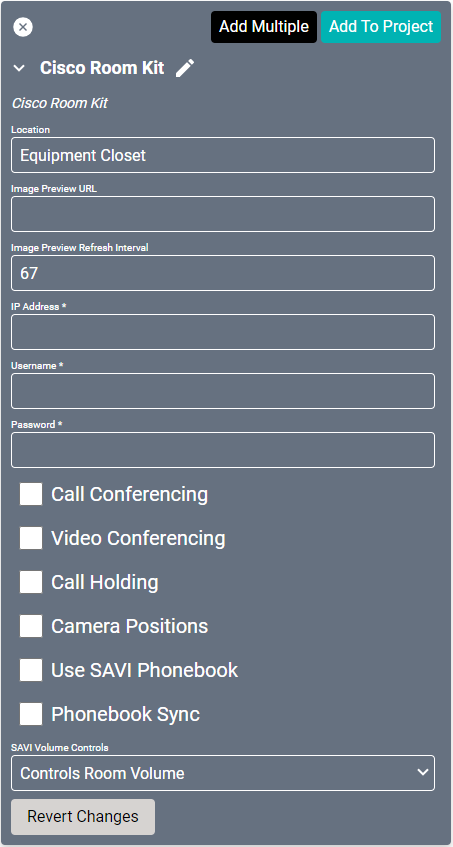

# Cisco Room Kit Driver

The [Cisco Room Kit](https://www.cisco.com/c/en/us/support/collaboration-endpoints/spark-room-kit/model.html) is a line of video conferencing systems. With the ability to interface with any of the Webex Room Series devices, SAVI gives full control to the user through the familiar SAVI User Interface.

#### Properties

* **Name:** Name of the device.

* **Location:** Location of the device within the Project. New Locations can be created by selecting this field, typing in a new name, and then selecting the corresponding "Add New Tag" option or pressing Enter on your keyboard.

* **IP Address:** The destination IP address that SAVI will use when communicating with the device.

* **Username:** Login username of the device.

* **Password:** Login password of the device.

* **Call Conferencing:** Enables support for Cisco codec "Add to Call" conferencing.

* **Video Conferencing:** Enables support for camera controls.

* **Call Holding:** Enables support for putting calls on hold.

* **Camera Positions:** Enables support for Cisco saved camera positions.

* **Use SAVI Phonebook:** Enable/Disable SAVI UI for SAVI internal contact management. Synced contacts from the device cannot be edited/deleted from SAVI.

* **Phonebook Sync:** If phonebook is enabled it will be synced witch Cisco contacts. These cannot be edited from SAVI.

* **SAVI Volume Controls:** Determines how SAVI volume controls the Cisco device.
  * **Hide Volume Buttons:** Removes volume controls from the interface.
  * **Controls Device Volume:** Volume controls the device volume.
  * **Controls Room Volume:** Volume controls the room speaker volume.

### Connections

##### Input

* **PC Audio:** Standard 3.5mm audio jack.

* **DVI:** Content sharing input.

##### Output

* **Headphones:** Standard 3.5mm audio jack.

* **HDMI 1:** Audio/video primary output.

* **HDMI 2:** Audio/video secondary output.