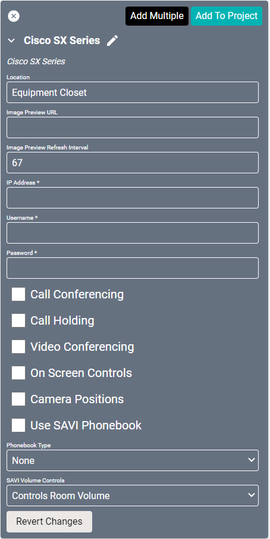
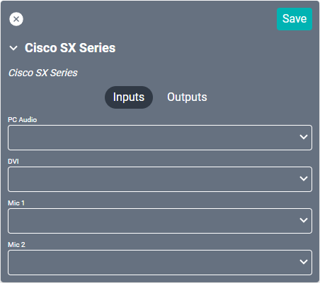
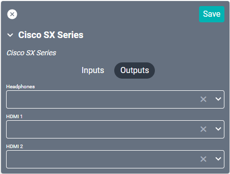

# Cisco SX Series Driver

This driver interfaces with [Cisco's TelePresence SX Series](https://www.cisco.com/c/en/us/support/collaboration-endpoints/telepresence-quick-set-series/series.html) teleconferencing devices.

#### Properties

* **Name:** Name of the device.

* **Location:** Location of the device within the Project. New Locations can be created by selecting this field, typing in a new name, and then selecting the corresponding "Add New Tag" option or pressing Enter on your keyboard.

* **IP Address:** The destination IP address that SAVI will use when communicating with the device.

* **Username:** Login username of the device.

* **Password:** Login password of the device.

* **Call Conferencing:** Enables support for Cisco codec "Add to Call" conferencing.

* **Call Holding:** Enables support for putting calls on hold.

* **Video Conferencing:** Enables support for camera controls.

* **On Screen Controls:** Enables support for displaying controls on the screen.

* **Camera Positions:** Enables support for Cisco saved camera positions.

* **Use SAVI Phonebook:** Enable/Disable SAVI UI for SAVI internal contact management. Synced contacts from the device cannot be edited/deleted from SAVI.

* **Phonebook Type:**
  * **None:** No phonebook.
  * **Local:** Phonebook is stored on the physical device.
  * **Corporate:** Retrieves phonebook information from the TMS server.

* **SAVI Volume Controls:** Determines how SAVI volume controls the Cisco device.
  * **Hide Volume Buttons:** Removes volume controls from the interface.
  * **Controls Device Volume:** Volume controls the device volume.
  * **Controls Room Volume:** Volume controls the room speaker volume.

### Connections

##### Input

* **PC Audio:** Standard 3.5mm audio jack.

* **DVI:** Connection to video source.

* **Mic 1:** Primary MIC input.

* **Mic 2:** Secondary MIC input.

##### Output

* **Headphones:** Standard 3.5mm audio jack.

* **HDMI 1:** Primary audio/video output.

* **HDMI 2:** Secondary audio/video output.
