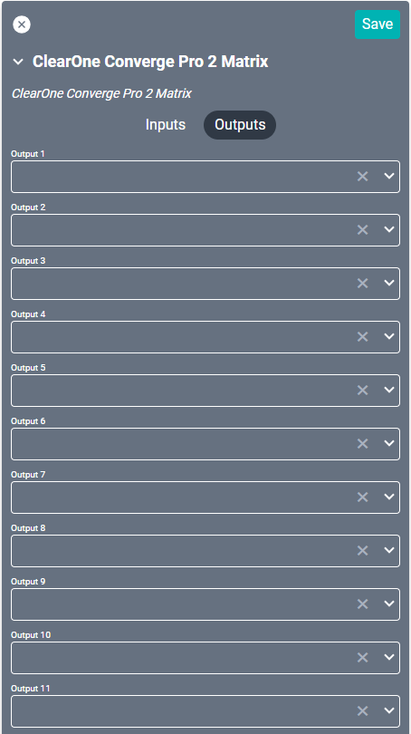

# ClearOne Converge Pro 2 Drivers
These drivers control separate sections of the [Converge Pro 2](https://www.clearone.com/converge-pro-2), an audio DSP for conferencing. They may be used as stand-alone connections or in tandem.

## ClearOne Converge Pro 2 Conference
This driver interfaces with ClearOne's rack mountable conferencing product, allowing SAVI integration. Most projects with this device will use this driver for conferencing control. 

#### Properties

* **Name:** Name of the device.

* **Location:** Location of the device within the Project. New Locations can be created by selecting this field, typing in a new name, and then selecting the corresponding "Add New Tag" option or pressing Enter on your keyboard.

* **IP Address:** The destination IP address that SAVI will use when communicating with the device.

* **Username:** Login username of the device.

* **Password:** Login password of the device.

* **Call Type:** Determines what type of infrastructure the calls operate on.
  * **VoIP:** Voice over IP. These are data based connections.
  * **Telco:** This is the analog connection that many telephone companies default to.

* **Endpoint Name:** The Endpoint Name within the Converge Console.

* **Call Conferencing:** Enables visual support for Cisco codec "Add to Call" conferencing. This is always available in the API.

* **Join Calls:** Enables visual support for joining added calls together on a party line (requires the "Add Calls" option on the line from the telco). This is always available in the API.

* **Call Holding:** Enables visual support for putting calls on hold. This is always available in the API.

* **SAVI Volume Controls:** Determines how SAVI volume controls the device.
  * **Hide Volume Buttons:** Removes volume controls from the interface.
  * **Controls Device Volume:** Volume controls the device volume.
  * **Controls Room Volume:** Volume controls the room speaker volume.

* **Volume Scale:** Sets the volume indicator to either db (decibels), or percentage.

### Connections
If using this driver as an Alternate Volume Control, leave all connections blank.

##### Output

* **Output:** Leave blank.

------

## ClearOne Converge Pro 2 Matrix
This driver controls the DSP section of the device.

#### Properties

* **Name:** Name of the device.

* **Location:** Location of the device within the Project. New Locations can be created by selecting this field, typing in a new name, and then selecting the corresponding "Add New Tag" option or pressing Enter on your keyboard.

* **IP Address:** The destination IP address that SAVI will use when communicating with the device.

* **Username:** Login username of the device.

* **Password:** Login password of the device.

* **Max Input dB:** Maximum decibels allowed. Set to 20 by default.

* **Min Input dB:** Minimum decibels allowed. Set to -65 by default.

* **Max Output dB:** Maximum decibels allowed. Set to 20 by default.

* **Min Output dB:** Minimum decibels allowed. Set to -65 by default.

* **Input (1-36) Name:** Input name within the Converge Console.

* **Input (1-36) Crosspoint Type:** Determines the type of crosspoint within the Converge Console.
  * **Normal:** Green in Converge Console.
  * **Gated:** Only for Mic inputs. Signal is routed through all circuits. Yellow in Converge Console.
  * **Non-Gated:** Only for Mic inputs. Signal is routed through all circuits *except* the Auto Mixer. Blue in Converge Console.
  * **Pre-AEC:** Only for Mic inputs. Signal is *not* routed through the Automatic Echo Canceler (AEC), the Noise Canceler (NC), or the Automatic Level Control (ALC). Brown in Converge Console.

* **Output (1-36) Name:** Output name within the Converge Console.

### Connections

##### Input

* **Input (1-36):** Supports up to thirty-six Mic or Line inputs (Mic inputs are usually limited to the first four inputs).

##### Output

* **Output (1-36):** Up to thirty-six Line outputs (may be limited by hardware).
