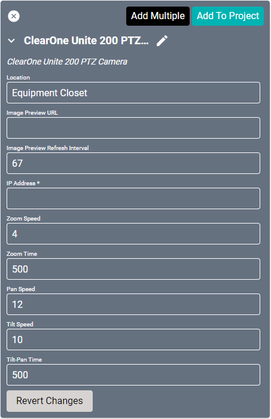
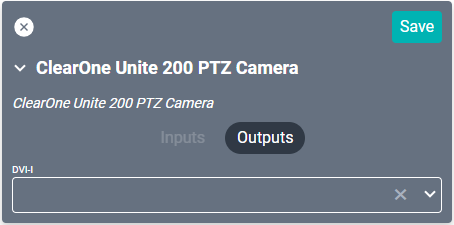

# ClearOne Unite 200 PTZ Camera Driver

This driver interfaces with ClearOne's fully controllable [HD video capture device](https://www.clearone.com/unite-200-ptz-camera-1), allowing SAVI integration and control. 

#### Properties

* **Name:** Name of the device.

* **Location:** Location of the device within the Project. New Locations can be created by selecting this field, typing in a new name, and then selecting the corresponding "Add New Tag" option or pressing Enter on your keyboard.

* **IP Address:** The destination IP address that SAVI will use when communicating with the device.

* **Zoom Speed:** Speed the camera will zoom at 0 (low) - 7 (high). Set to 4 by default.

* **Zoom Time:** Amount in milliseconds that the camera will zoom for before stopping. Set to 500 by defalut.

* **Pan Speed:** Speed the camera will pan (left and right) at 1 (low) - 24 (high). Set to 12 by default.

* **Tilt Speed:** Speed the camera will tilt (up and down) at 1 (low) - 20 (high). Set to 10 by default.

* **Tilt-Pan Time:** Amount in milliseconds that the camera will tilt or pan for before stopping. Set to 500 by default.

### Connections

##### Output

* **DVI-I:** DVI output connection. Supports DVI-I and DVI-D.
