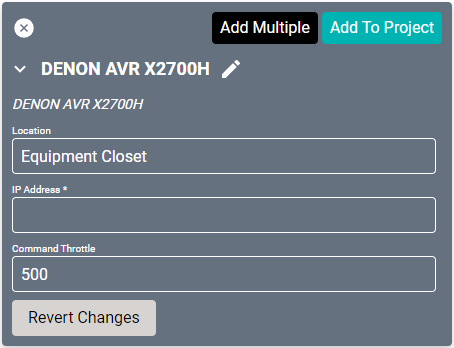
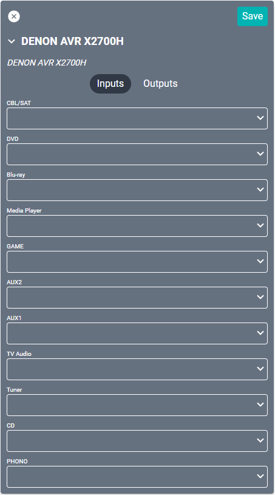
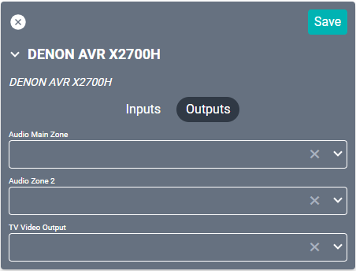

# DENON AVR X2700H Driver
This driver interfaces with the [Denon X2700H Audio Video Receiver](https://www.denon.com/en-us/product/av-receivers/avr-x2700h).

#### Properties

* **Name:** Name of the device.

* **Location:** Location of the device within the Project. New Locations can be created by selecting this field, typing in a new name, and then selecting the corresponding "Add New Tag" option or pressing Enter on your keyboard.

* **IP Address:** The destination IP address that SAVI will use when communicating with the device.

* **Command Throttle:** The number of milliseconds to wait between sending commands. Set to 500 by default.

### Connections
This device has the ability to change the logical connection name for each physical input. The connections in SAVI should correspond to the physical connection name screen-printed on the back of the device.

##### Input

* **CBL/SAT:** HDMI 1 (assignable) with or without composite audio 1 or coaxial digital audio.

* **DVD:** HDMI 2 (assignable) with or without composite audio 2.

* **Blu-ray:** HDMI 3 (assignable) with or without composite audio 3.

* **Media Player:** HDMI 4 (assignable) with or without composite audio 4.

* **GAME:** HDMI 5 (assignable) with or without optical audio 2.

* **AUX2:** audio in (assignable).

* **AUX1:** audio in (assignable).

* **TV Audio:** Optical audio 1 (assignable).

* **Tuner:** AM/FM signal. Strip connect and coaxial.

* **CD:** L/R audio in 4 (assignable).

* **PHONO:** L/R audio in.

##### Output

* **Audio Main Zone:** Main speaker setup. This will be assigned to a SAVI audio zone.

* **Audio Zone 2:** L/R + Sub-woofer audio output.

* **TV Video Output:** HDMI, Components, or composite video output.
