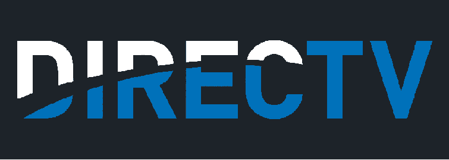
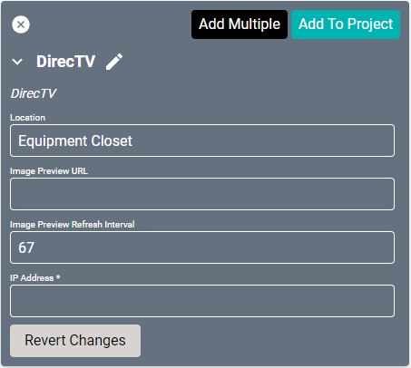
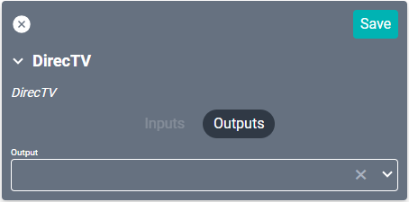
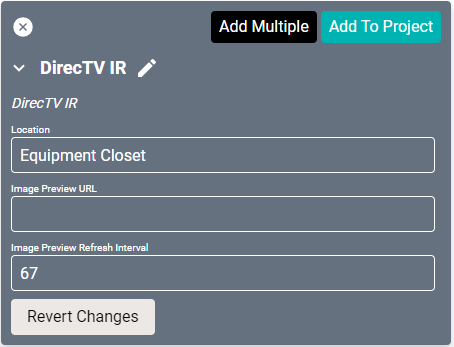
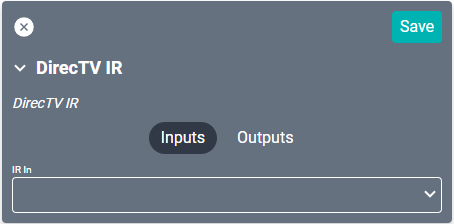
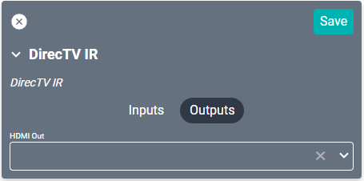

<div style="text-align: center">

<a href="../../../Assets/Knowledge-Base/Creator/Drivers/Logos/directv-logo.png">
  
</a>
</div>

# DirecTV Drivers

## DirecTV Driver
<a href="../../../Assets/Knowledge-Base/Creator/creator-direct-tv-preview.png">
  
</a>

The DirecTV driver allows control of your cable box through IP. After you add a DirecTV source to the project, a control icon will appear in the top right corner near SAVE. There you should have a live preview of the current channel or view of the cable box as well as the ability to change channels, volume, and other basic remote functions.

#### Properties
<a href="../../../Assets/Knowledge-Base/Creator/Drivers/direct-tv.png">
  
</a>

* **Name:** Name of the device.

* **Location:** Location of the device within the Project. New Locations can be created by selecting this field, typing in a new name, and then selecting the corresponding "Add New Tag" option or pressing Enter on your keyboard.


* **IP Address:** The destination IP address that SAVI will use when communicating with the device.

* **Image Preview URL:** This field will auto generate a snapshot image URL when connected to a Stream.One.

* **Image Preview Refresh Interval:** This will set how often Creator should refresh (reload) the Preview Image. By default this is set to 67ms.

### Connections

##### Output
<a href="../../../Assets/Knowledge-Base/Creator/Drivers/directv-connections-output.png">
  
</a>

* **Output:** Connects to any video output source, such as a Stream.One or other encoder. Multiple connections are allowed but not recommended.

--------

## DirecTV IR Driver

This DirecTV driver allows control of your cable box through IR.

#### Properties
<a href="../../../Assets/Knowledge-Base/Creator/Drivers/directv-ir.png">
  
</a>

* **Name:** Name of the device.

* **Location:** Location of the device within the Project. New Locations can be created by selecting this field, typing in a new name, and then selecting the corresponding "Add New Tag" option or pressing Enter on your keyboard.


* **Image Preview URL:** This field will auto generate a snapshot image URL when connected to a Stream.One.

* **Image Preview Refresh Interval:** This will set how often Creator should refresh (reload) the Preview Image. By default this is set to 67ms.

### Connections

This driver only has a single connection under Input and Output.

##### Input
<a href="../../../Assets/Knowledge-Base/Creator/Drivers/directv-ir-connections-input.png">
  
</a>

* **IR In:** Use this dropdown to select the SAVI Connect IR Module and port that will provide this device with IR control.

##### Output
<a href="../../../Assets/Knowledge-Base/Creator/Drivers/directv-ir-connections-output.png">
  
</a>

* **HDMI Out:** HDMI output connection.

---

## DirecTV STB Setup
When using the H44 DirecTV Set-top Box, you will need to set it to Commercial Mode, detailed in the [H44 Commercial Installations Job Aid](../../../Assets/Files/H44+Commercial+Installations_Job_Aid.pdf). Afterward, SAVI should be able to read channel data from the **S**et-top Box **H**TTP **E**xported **F**unctionality (SHEF) API.

#### Troubleshooting
If the DirecTV STB is not working correctly, first verify that it is in Commercial Mode.

1. Navigate to the SHEF API by entering the DirecTV STB IP address followed by `:8080/tv/getTuned`
    >**Example:** `http://10.7.1.67:8080/tv/getTuned`
2. Verify the SHEF API returns a reply such as:
    ```javascript
    {
      "callsign": "ESPNHD",
      "date": "20220802",
      "duration": 7200,
      "episodeTitle": "Trade Deadline Special",
      "isOffAir": false,
      "isPclocked": 3,
      "isPpv": false,
      "isRecording": false,
      "isVod": false,
      "major": 206,
      "minor": 65535,
      "offset": 2592,
      "programId": "256772906",
      "rating": "No Rating",
      "startTime": 1659470400,
      "stationId": 2220255,
      "status": {
        "code": 200,
        "commandResult": 0,
        "msg": "OK.",
        "query": "/tv/getTuned"
      },
      "title": "Baseball Tonight"
    }
    ```

3. Next, verify that the SHEF API can change channels. Enter the DirecTV STB IP address followed by `:8080/tv/tune?major=676&minor=1`
    >**Example:** `http://10.7.1.67:8080/tv/tune?major=676&minor=1`
4. Verify the SHEF API returns a reply such as:
    ```javascript
    {"status": {
    "code": 200,
    "commandResult": 0,
    "msg": "OK.",
    "query": "/tv/tune?major=676&minor=1"
    }}
    ```