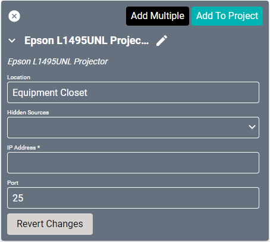
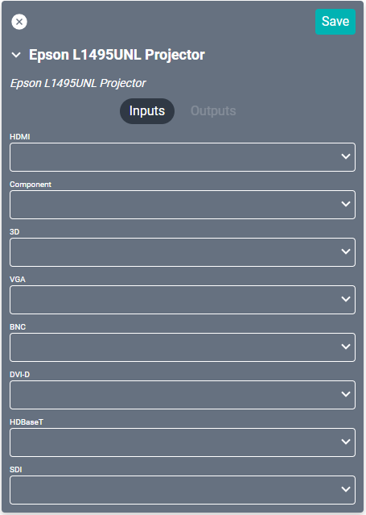

# Epson L1495UNL Projector Driver
This driver interfaces with Epson's [L1495UNL commercial projector](https://epson.com/For-Work/Projectors/Large-Venue/Pro-L1495UNL-WUXGA-3LCD-Laser-Projector-with-4K-Enhancement/p/V11HA16820).

#### Properties

* **Name:** Name of the device.

* **Location:** Location of the device within the Project. New Locations can be created by selecting this field, typing in a new name, and then selecting the corresponding "Add New Tag" option or pressing Enter on your keyboard.

* **Hidden Sources:** Sources that should not be shown when selecting sources for this device.

* **IP Address:** The destination IP address that SAVI will use when communicating with the device.

* **Port:** Network port setting. Set to 25 as default.

### Connections

##### Input

* **HDMI:** HDMI input.

* **Component:** R/Cr/Pr, G/Y, and B/Cb/Pb BNC connections.

* **3D:** H/C Sync and V Sync BNC connections.

* **VGA:** Computer connection.

* **BNC:** H/C Sync and V Sync connections.

* **DVI-D:** DVI-D input. Not compatible with DVI-I.

* **HDBaseT:** Ethernet video stream connection.

* **SDI:** Coaxial 3G/HD/SD connection.
