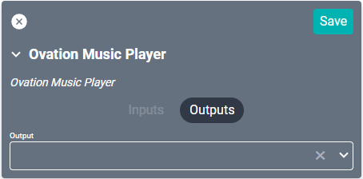

# Ovation Music Player Driver
This driver is compatible with both the [Solo](https://www.fusionrd.com/solo-2-source-music-server) and [Duet](https://www.fusionrd.com/duet-3-source-music-server) models.

#### Properties

* **Name:** Name of the device.

* **Location:** Location of the device within the Project. New Locations can be created by selecting this field, typing in a new name, and then selecting the corresponding "Add New Tag" option or pressing Enter on your keyboard.

* **IP Address:** The destination IP address that SAVI will use when communicating with the device.

* **MAC Address:** The unique address of the device.

### Connections

##### Output

* **Output:** Connects to the Input of the audio device used for routing (such as the SAVI DSP).

# Logitech Media Server
Ovation Music Player uses Logitech Media Server. To find the MAC address for the Creator driver, navigate to `http://[ip of player]:9000/settings/index.html` to the Information tab. All zones will be listed under Player Information which displays the Player MAC Address.

Be sure to use the IP address of the Ovation device that you navigated to and ***not*** the Player IP Address listed under Player Information.

