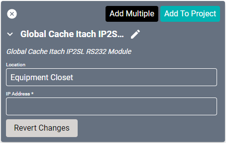
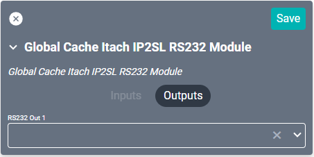

# Global Caché Itach IP2SL RS232 Module Driver
[This device](https://www.globalcache.co.uk/product/global-cache-ip2sl-p-itach-tcp-ip-to-serial-network-adapter-rs232-with-power-over-ethernet/) is a serial to IP converter. It is also compatible with Flex and SAVI Connect I/O serial products.

#### Properties

* **Name:** Name of the device.

* **Location:** Location of the device within the Project. New Locations can be created by selecting this field, typing in a new name, and then selecting the corresponding "Add New Tag" option or pressing Enter on your keyboard.

* **IP Address:** The destination IP address that SAVI will use when communicating with the device.

### Connections
##### Output

* **RS232 Out 1:** RS232 output.
