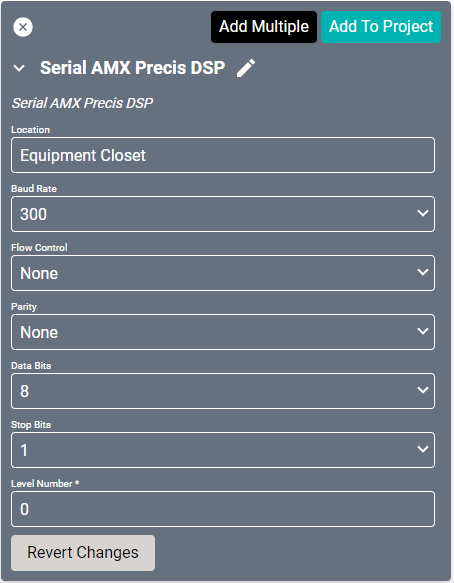
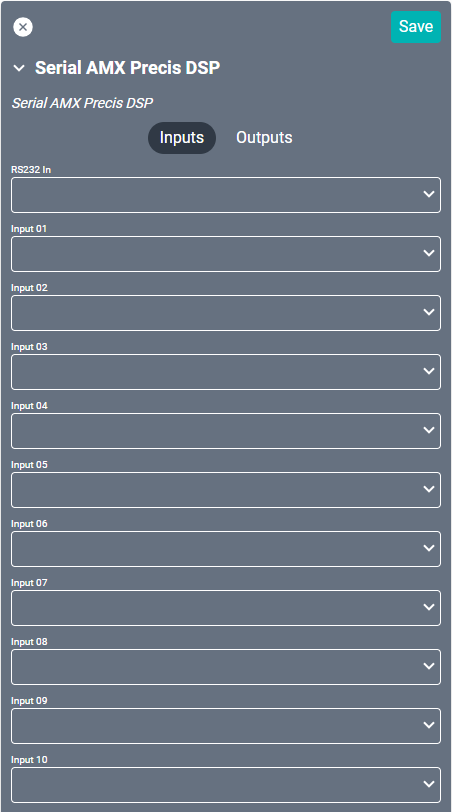
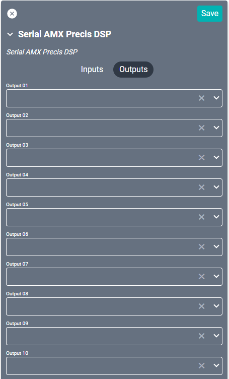

# Serial AMX Precis DSP Driver

This driver supports the [Harman AMX Precis DSP](https://www.amx.com/en/products/precis-dsp-stereo-rca-dvc "Harman AMX Precis DSP") through serial connection.

#### Properties

* **Name:** Name of the device.

* **Location:** Location of the device within the Project. New Locations can be created by selecting this field, typing in a new name, and then selecting the corresponding "Add New Tag" option or pressing Enter on your keyboard.

* **Baud Rate:** Set to 300 by default.

* **Flow Control:** Sets the serial port handshake type.
  * None - Turned off.
  * Hardware - Hardware flow control.
  * XON/XOFF - Software flow control.
  * Unknown - Flow control is unknown.

* **Parity:** Sets the serial port parity type for error detecting.
  * None - Turned off.
  * Even - Even parity bit.
  * Odd - Odd parity bit.
  * Unknown - Parity is unknown.

* **Data Bits:** Set to 8.

* **Stop Bits:** Set to either 1 or 2.

* **Level Number:** This Corresponds to the Virtual Matrix number. This is usually 0.

### Connections

##### Input

* **Input (01-18):** Up to eighteen L/R audio inputs.

##### Output

* **Output (01-18):** Up to eighteen L/R audio outputs.
