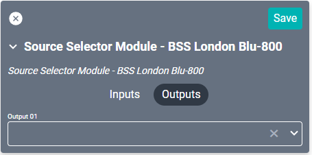

# Harman BSS London Blu-800 Drivers

These drivers support the [Harman BSS BLU-800 Matrix](https://bssaudio.com/en/products/blu-800 "Harman DBX Zone Pro 1260 Matrix"), [Harman BSS BLU-806 Matrix](https://bssaudio.com/en/products/blu-806da-blu-806), and the [Harman BSS BLU-160 Matrix](https://bssaudio.com/en/products/blu-160) through the Audio Architect software. 

Gain modules are needed for volume control and one of the Source or Matrix drivers are needed for source control within SAVI. Requirements are determined by the virtual project setup within the Audio Architect software.

## Gain Module
This driver controls volume only. It connects on a one-to-one (input to output) basis so a driver will be needed for each input and output pair. Connections should never be used, rather use this driver as an Alternate Volume Control through your project's output device card.

#### Properties

* **Name:** Name of the device.

* **Location:** Location of the device within the Project. New Locations can be created by selecting this field, typing in a new name, and then selecting the corresponding "Add New Tag" option or pressing Enter on your keyboard.

* **IP Address:** The destination IP address that SAVI will use when communicating with the device.

* **HiQnet Address:** A 14 digit address key (such as `0x083203000100`).

* **Throttle Time (ms):** This device may have issues processing too many commands at once. This value will set how many milliseconds to wait after each command to the unit. Set to 0 by default.

### Connections

##### Input

* **Input 01:** Euroblock (phoenix) connector.

##### Output

* **Output 01:** Euroblock (phoenix) connector.

<!--
## N Input Gain Module
This driver controls volume only. Connections are not needed when using this driver as an Alternate Volume Control.

#### Properties

* **Name:** Name of the device.

* **Location:** Location of the device within the Project. New Locations can be created by selecting this field, typing in a new name, and then selecting the corresponding "Add New Tag" option or pressing Enter on your keyboard.

* **IP Address:** The destination IP address that SAVI will use when communicating with the device.

* **HiQnet Address:** A 14 digit address key (such as `0x083203000100`).

* **Throttle Time (ms):** This device may have issues processing too many commands at once. This value will set how many milliseconds to wait after each command to the unit. Set to 0 by default.

### Connections

##### Output

* **Output (01-11):** Euroblock (phoenix) connectors.

-->
----

## Matrix Mixer Module
This driver will require Gain Modules to control volume.

#### Properties

* **Name:** Name of the device.

* **Location:** Location of the device within the Project. New Locations can be created by selecting this field, typing in a new name, and then selecting the corresponding "Add New Tag" option or pressing Enter on your keyboard.

* **IP Address:** The destination IP address that SAVI will use when communicating with the device.

* **HiQnet Address:** A 14 digit address key (such as `0x083203000100`).

* **Throttle Time (ms):** This device may have issues processing too many commands at once. This value will set how many milliseconds to wait after each command to the unit. Set to 0 by default.

### Connections

##### Input

* **Input (01-48):** Euroblock (phoenix) connectors.

##### Output

* **Output (01-48):** Euroblock (phoenix) connectors.

## Matrix Router Module
This driver will require Gain Modules to control volume.

#### Properties

* **Name:** Name of the device.

* **Location:** Location of the device within the Project. New Locations can be created by selecting this field, typing in a new name, and then selecting the corresponding "Add New Tag" option or pressing Enter on your keyboard.

* **IP Address:** The destination IP address that SAVI will use when communicating with the device.

* **HiQnet Address:** A 14 digit address key (such as` 0x083203000100`).

* **Throttle Time (ms):** This device may have issues processing too many commands at once. This value will set how many milliseconds to wait after each command to the unit. Set to 0 by default.

### Connections

##### Input

* **Input (01-48):** Euroblock (phoenix) connectors.

##### Output

* **Output (01-48):** Euroblock (phoenix) connectors.

## Source Matrix Module
This driver will require Gain Modules to control volume.

#### Properties

* **Name:** Name of the device.

* **Location:** Location of the device within the Project. New Locations can be created by selecting this field, typing in a new name, and then selecting the corresponding "Add New Tag" option or pressing Enter on your keyboard.

* **IP Address:** The destination IP address that SAVI will use when communicating with the device.

* **HiQnet Address:** A 14 digit address key (such as `0x083203000100`).

* **Throttle Time (ms):** This device may have issues processing too many commands at once. This value will set how many milliseconds to wait after each command to the unit. Set to 0 by default.

### Connections

##### Input

* **Input (01-48):** Euroblock (phoenix) connectors.

##### Output

* **Output (01-48):** Euroblock (phoenix) connectors.

## Source Selector Module
This driver will require Gain Modules to control volume.

#### Properties

* **Name:** Name of the device.

* **Location:** Location of the device within the Project. New Locations can be created by selecting this field, typing in a new name, and then selecting the corresponding "Add New Tag" option or pressing Enter on your keyboard.

* **IP Address:** The destination IP address that SAVI will use when communicating with the device.

* **HiQnet Address:** A 14 digit address key (such as `0x083203000100`).

* **Throttle Time (ms):** This device may have issues processing too many commands at once. This value will set how many milliseconds to wait after each command to the unit. Set to 0 by default.

### Connections

##### Input

* **Input (01-48):** Euroblock (phoenix) connectors.

##### Output

* **Output 01:** Euroblock (phoenix) connectors.
