

# Harman DBX Zone Pro 1260 Drivers

These drivers support the [Harman DBX Zone Pro 1260 Matrix](https://dbxpro.com/en/products/1260 "Harman DBX Zone Pro 1260 Matrix") and [Harman DBX Zone Pro 1260m Matrix](https://dbxpro.com/en/products/1260m "Harman DBX Zone Pro 1260m Matrix"). Each device has a Serial and an IP driver (you should not use both). We typically recommended using the serial drivers. IP firmware has a known issue (will not reconnect if connection is lost) that the manufacturer will not address since the hardware is no longer supported.

## Harman DBX Zone Pro 1260 Serial Driver
#### Properties
<a href="../../../Assets/Knowledge-Base/Creator/Drivers/harman-dbx-zone-pro-1260-serial-matrix-01.png">
  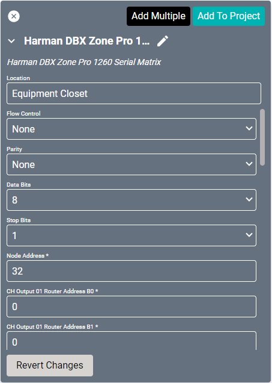
</a>
<a href="../../../Assets/Knowledge-Base/Creator/Drivers/harman-dbx-zone-pro-1260-serial-matrix-02.png">
  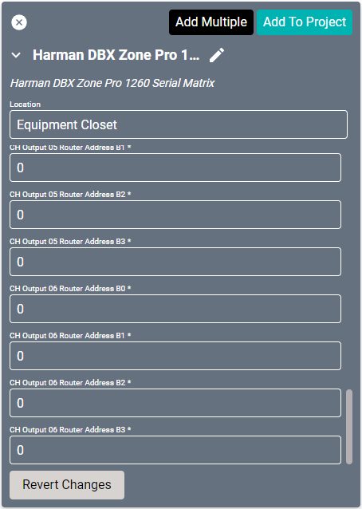
</a>

* **Name:** Name of the device.

* **Location:** Location of the device within the Project. New Locations can be created by selecting this field, typing in a new name, and then selecting the corresponding "Add New Tag" option or pressing Enter on your keyboard.

* **Flow Control:** Sets the serial port handshake type.
  * None - Turned off.
  * Hardware - Hardware flow control.
  * XON/XOFF - Software flow control.
  * Unknown - Flow control is unknown.

* **Parity:** Sets the serial port parity type for error detecting.
  * None - Turned off.
  * Even - Even parity bit.
  * Odd - Odd parity bit.
  * Unknown - Parity is unknown.

* **Data Bits:** Set to 8.

* **Stop Bits:** Set to either 1 or 2.

* **Node Address:** Set to 32 by default.

* **CH Output (01-06) Router Address B0:** From the Zone Pro designer software, select the router device in line with this specific output, click ctrl+shift+o and use the b0 value. Router device information is necessary for connecting audio and controlling output volume.

* **CH Output (01-06) Router Address B1:** From the Zone Pro designer software, select the router device in line with this specific output, click ctrl+shift+o and use the b1 value. Router device information is necessary for connecting audio and controlling output volume.

* **CH Output (01-06) Router Address B2:** From the Zone Pro designer software, select the router device in line with this specific output, click ctrl+shift+o and use the b2 value. Router device information is necessary for connecting audio and controlling output volume.

* **CH Output (01-06) Router Address B3:** From the Zone Pro designer software, select the router device in line with this specific output, click ctrl+shift+o and use the b3 value. Router device information is necessary for connecting audio and controlling output volume.

### Connections

##### Input
<a href="../../../Assets/Knowledge-Base/Creator/Drivers/harman-dbx-zone-pro-1260-serial-matrix-connections-input.png">
  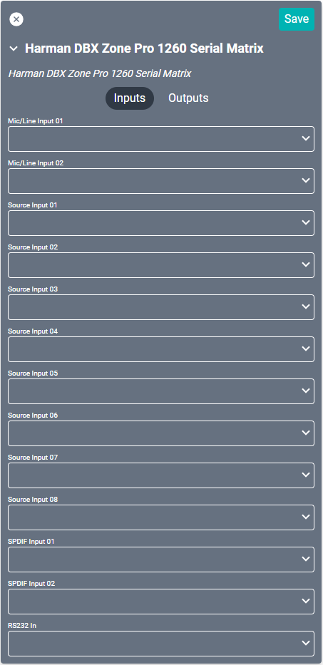
</a>

* **Mic/Line Input (01-02):** Up to two mic or line inputs through euroblock (phoenix) connectors.

* **Source Input (01-08):** Up to eight L/R source inputs.

* **SPDIF Input (01-02):** Digital coaxial audio.

* **RS232 In:** Serial input for control.

##### Output
<a href="../../../Assets/Knowledge-Base/Creator/Drivers/harman-dbx-zone-pro-1260-serial-matrix-connections-output.png">
  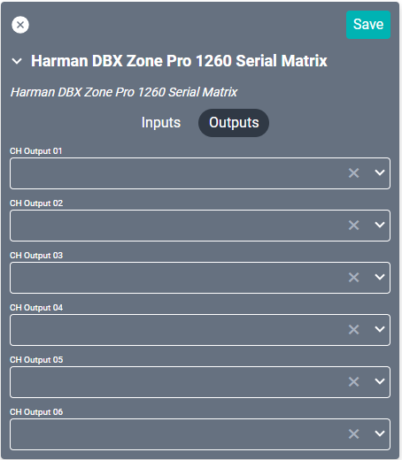
</a>

* **CH Output (01-06):** Euroblock (phoenix) connectors.

## Harman DBX Zone Pro 1260 IP Driver
Not recommended for use.

#### Properties

<a href="../../../Assets/Knowledge-Base/Creator/Drivers/harman-dbx-zone-pro-1260-matrix-02.png">
  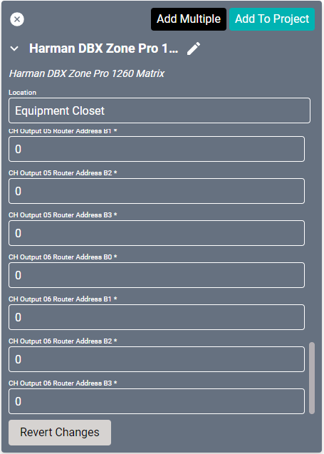
</a>

* **Name:** Name of the device.

* **Location:** Location of the device within the Project. New Locations can be created by selecting this field, typing in a new name, and then selecting the corresponding "Add New Tag" option or pressing Enter on your keyboard.

* **IP Address:** The destination IP address that SAVI will use when communicating with the device.

* **Throttle Time (ms):** This device may have issues processing too many commands at once. This value will set how many milliseconds to wait after each command to the unit. Set to 500 by default.

* **Node Address:** Set to 32 by default.

* **CH Output (01-06) Router Address B0:** From the Zone Pro designer software, select the router device in line with this specific output, click ctrl+shift+o and use the b0 value. Router device information is necessary for connecting audio and controlling output volume.

* **CH Output (01-06) Router Address B1:** From the Zone Pro designer software, select the router device in line with this specific output, click ctrl+shift+o and use the b1 value. Router device information is necessary for connecting audio and controlling output volume.

* **CH Output (01-06) Router Address B2:** From the Zone Pro designer software, select the router device in line with this specific output, click ctrl+shift+o and use the b2 value. Router device information is necessary for connecting audio and controlling output volume.

* **CH Output (01-06) Router Address B3:** From the Zone Pro designer software, select the router device in line with this specific output, click ctrl+shift+o and use the b3 value. Router device information is necessary for connecting audio and controlling output volume.

### Connections

##### Input
<a href="../../../Assets/Knowledge-Base/Creator/Drivers/harman-dbx-zone-pro-1260-matrix-connections-input.png">
  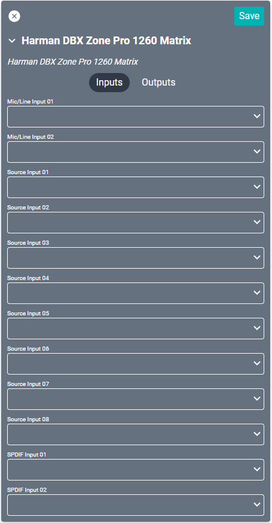
</a>

* **Mic/Line Input (01-02):** Up to two mic or line inputs through euroblock (phoenix) connectors.

* **Source Input (01-08):** Up to eight L/R source inputs.

* **SPDIF Input (01-02):** Digital coaxial audio.

##### Output
<a href="../../../Assets/Knowledge-Base/Creator/Drivers/harman-dbx-zone-pro-1260-matrix-connections-output.png">
  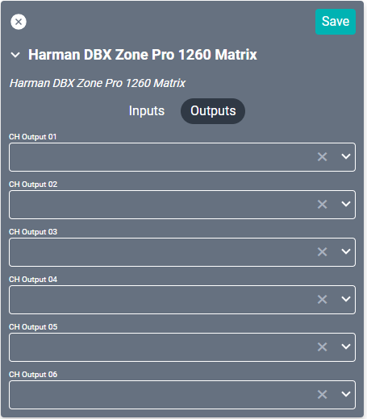
</a>

* **CH Output (01-06):** Euroblock (phoenix) connectors.

-------

## Harman DBX Zone Pro 1260M Serial Driver
#### Properties
<a href="../../../Assets/Knowledge-Base/Creator/Drivers/harman-dbx-zone-pro-1260m-serial-matrix-01.png">
  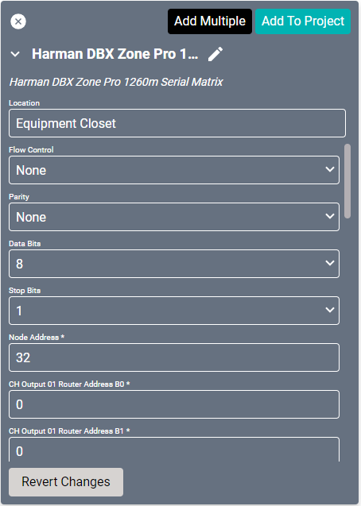
</a>

* **Name:** Name of the device.

* **Location:** Location of the device within the Project. New Locations can be created by selecting this field, typing in a new name, and then selecting the corresponding "Add New Tag" option or pressing Enter on your keyboard.

* **Flow Control:** Sets the serial port handshake type.
  * None - Turned off.
  * Hardware - Hardware flow control.
  * XON/XOFF - Software flow control.
  * Unknown - Flow control is unknown.

* **Parity:** Sets the serial port parity type for error detecting.
  * None - Turned off.
  * Even - Even parity bit.
  * Odd - Odd parity bit.
  * Unknown - Parity is unknown.

* **Data Bits:** Set to 8.

* **Stop Bits:** Set to either 1 or 2.

* **Node Address:** Set to 32 by default.

* **CH Output (01-06) Router Address B0:** From the Zone Pro designer software, select the router device in line with this specific output, click ctrl+shift+o and use the b0 value. Router device information is necessary for connecting audio and controlling output volume.

* **CH Output (01-06) Router Address B1:** From the Zone Pro designer software, select the router device in line with this specific output, click ctrl+shift+o and use the b1 value. Router device information is necessary for connecting audio and controlling output volume.

* **CH Output (01-06) Router Address B2:** From the Zone Pro designer software, select the router device in line with this specific output, click ctrl+shift+o and use the b2 value. Router device information is necessary for connecting audio and controlling output volume.

* **CH Output (01-06) Router Address B3:** From the Zone Pro designer software, select the router device in line with this specific output, click ctrl+shift+o and use the b3 value. Router device information is necessary for connecting audio and controlling output volume.

### Connections

##### Input
<a href="../../../Assets/Knowledge-Base/Creator/Drivers/harman-dbx-zone-pro-1260m-serial-matrix-connections-input.png">
  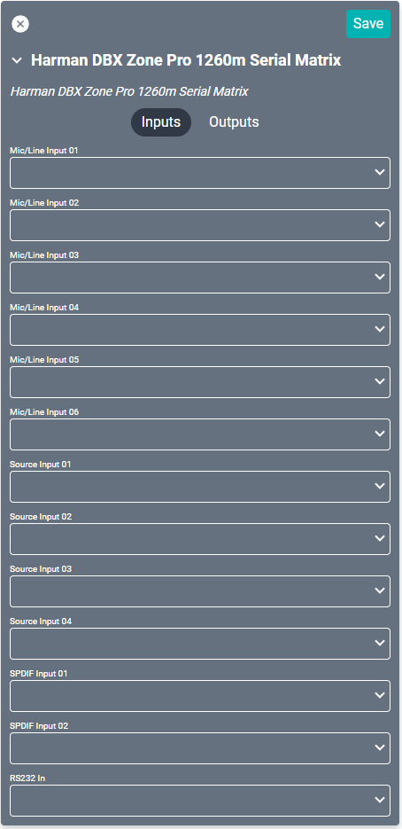
</a>

* **Mic/Line Input (01-06):** Up to six mic or line inputs through euroblock (phoenix) connectors.

* **Source Input (01-04):** Up to four L/R source inputs.

* **SPDIF Input (01-02):** Digital coaxial audio.

* **RS232 In:** Serial input for control.

##### Output
<a href="../../../Assets/Knowledge-Base/Creator/Drivers/harman-dbx-zone-pro-1260m-serial-matrix-connections-output.png">
  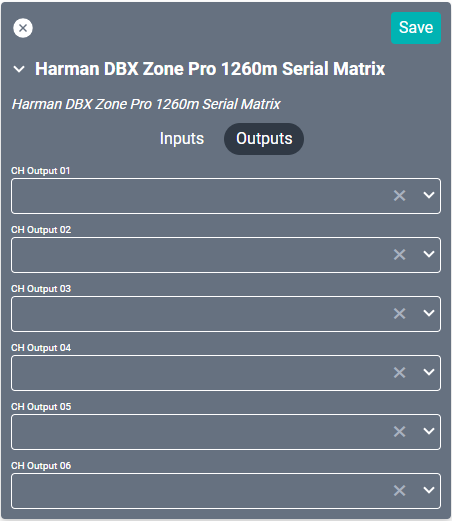
</a>

* **CH Output (01-06):** Euroblock (phoenix) connectors.

## Harman DBX Zone Pro 1260m IP Driver
Not recommended for use.

#### Properties
<a href="../../../Assets/Knowledge-Base/Creator/Drivers/harman-dbx-zone-pro-1260m-matrix-01.png">
  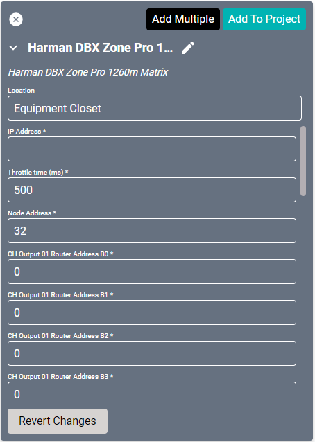
</a>
<a href="../../../Assets/Knowledge-Base/Creator/Drivers/harman-dbx-zone-pro-1260m-matrix-02.png">
  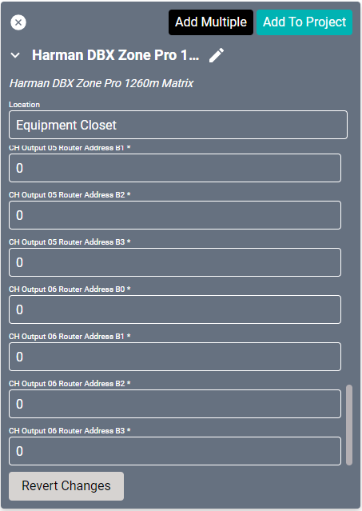
</a>

* **Name:** Name of the device.

* **Location:** Location of the device within the Project. New Locations can be created by selecting this field, typing in a new name, and then selecting the corresponding "Add New Tag" option or pressing Enter on your keyboard.

* **IP Address:** The destination IP address that SAVI will use when communicating with the device.

* **Throttle Time (ms):** This device may have issues processing too many commands at once. This value will set how many milliseconds to wait after each command to the unit. Set to 500 by default.

* **Node Address:** Set to 32 by default.

* **CH Output (01-06) Router Address B0:** From the Zone Pro designer software, select the router device in line with this specific output, click ctrl+shift+o and use the b0 value. Router device information is necessary for connecting audio and controlling output volume.

* **CH Output (01-06) Router Address B1:** From the Zone Pro designer software, select the router device in line with this specific output, click ctrl+shift+o and use the b1 value. Router device information is necessary for connecting audio and controlling output volume.

* **CH Output (01-06) Router Address B2:** From the Zone Pro designer software, select the router device in line with this specific output, click ctrl+shift+o and use the b2 value. Router device information is necessary for connecting audio and controlling output volume.

* **CH Output (01-06) Router Address B3:** From the Zone Pro designer software, select the router device in line with this specific output, click ctrl+shift+o and use the b3 value. Router device information is necessary for connecting audio and controlling output volume.

### Connections

##### Input
<a href="../../../Assets/Knowledge-Base/Creator/Drivers/harman-dbx-zone-pro-1260m-matrix-connections-input.png">
  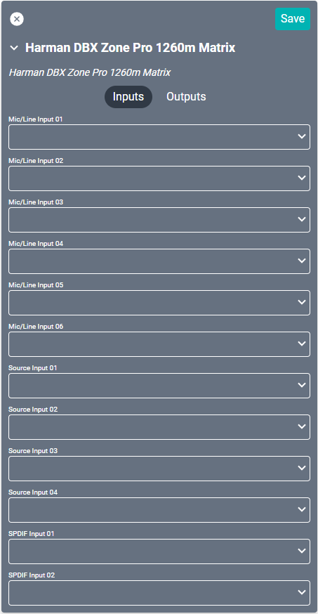
</a>

* **Mic/Line Input (01-06):** Up to six mic or line inputs through euroblock (phoenix) connectors.

* **Source Input (01-04):** Up to four L/R source inputs.

* **SPDIF Input (01-02):** Digital coaxial audio.

##### Output
<a href="../../../Assets/Knowledge-Base/Creator/Drivers/harman-dbx-zone-pro-1260m-matrix-connections-output.png">
  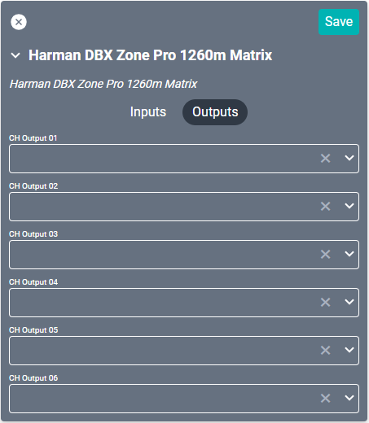
</a>

* **CH Output (01-06):** Euroblock (phoenix) connectors.
