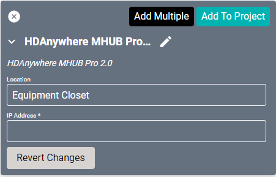
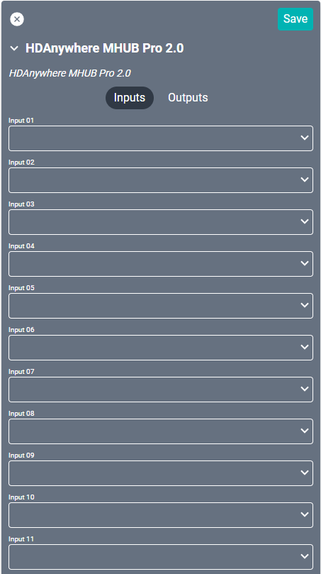
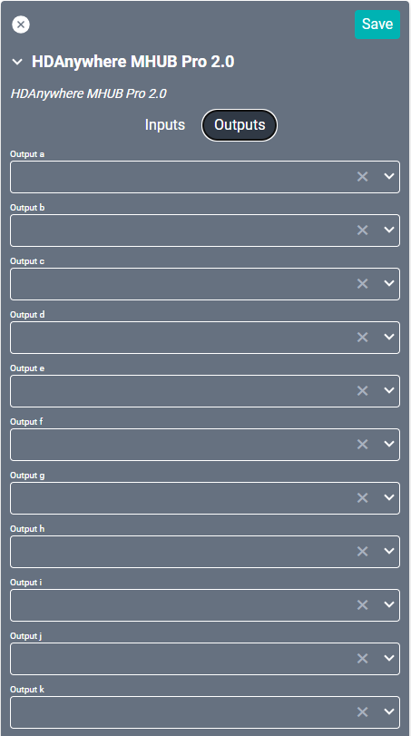

# HDAnywhere MHUB Pro 2.0 Driver
This driver supports the HDAnywhere [MHUB Pro 2.0](https://hdanywhere.com/products/matrix/pages/mhubpro244) HDMI matrix switch.

#### Properties

* **Name:** Name of the device.

* **Location:** Location of the device within the Project. New Locations can be created by selecting this field, typing in a new name, and then selecting the corresponding "Add New Tag" option or pressing Enter on your keyboard.

* **IP Address:** The destination IP address that SAVI will use when communicating with the device.

### Connections
MHUB systems can be stacked up to a maximum of 4 times. Stacks can be created using
only Audio Matrix devices or a combination of Audio Matrices and a single Video Matrix. Inputs and outputs in the driver allow for the increased devices from stacked matrixes.

##### Input

* **Input (01-24):** Allows up to twenty-four HDMI inputs controlled through a "master" device.

##### Output

* **Output (a-x):** Allows up to twenty-four HDMI or HDBaseT outputs controlled through a "master" device.
