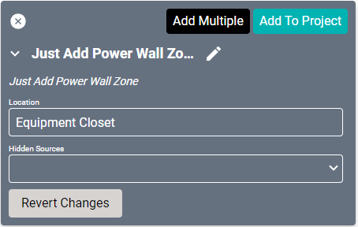

# Just Add Power Drivers
These drivers work together or independently to control [transmitters and receivers](http://justaddpower.com/product-range.html).

## Receiver Driver
Each display should have one of these Receiver drivers to control the device.

#### Properties

* **Name:** Name of the device.

* **Location:** Location of the device within the Project. New Locations can be created by selecting this field, typing in a new name, and then selecting the corresponding "Add New Tag" option or pressing Enter on your keyboard.

* **Hidden Sources:** Sources that should not be shown when selecting sources for this device.
* **IP Address:** The destination IP address that SAVI will use when communicating with the device.
* **Rotation:** The orientation of the display. 0 is default, with the display mounted horizontal. 90 and 270 are used when the display is mounted vertically (rotated either right or left). 180 is used when mounting the display horizontally upside-down (not recommended as most mounts are not designed for this).

#### Connections

##### Input

* **RJ 45:** Ethernet source.

-----
Will need to use either a cisco or luxul switch.

## Switch Cisco Driver
Needed to control receivers.

#### Properties

* **Name:** Name of the device.

* **Location:** Location of the device within the Project. New Locations can be created by selecting this field, typing in a new name, and then selecting the corresponding "Add New Tag" option or pressing Enter on your keyboard.

* **IP Address:** The destination IP address that SAVI will use when communicating with the device.

* **Username:** Login username of the device.

* **Password:** Login password of the device.

#### Connections

##### Input

* **Input Port (001-072):** Up to seventy-two sources.

##### Output

* **Output Port (001-072):** Up to seventy-two outputs.

## Switch Luxul Driver
#### Properties

* **Name:** Name of the device.

* **Location:** Location of the device within the Project. New Locations can be created by selecting this field, typing in a new name, and then selecting the corresponding "Add New Tag" option or pressing Enter on your keyboard.

* **IP Address:** The destination IP address that SAVI will use when communicating with the device.

* **Username:** Login username of the device.

* **Password:** Login password of the device.

* **Number of transmitters:** Set to 1 by default.

* **Number of receivers:** Set to 1 by default.

#### Connections

##### Input

* **Input Port (001-048):** Up to forty-eight sources.

##### Output

* **Output Port (001-048):** Up to forty-eight outputs.

----
Requires all 3 wall drivers 

## Wall Driver
Adding this will enable a wall scene in Facility View.

#### Properties

* **Name:** Name of the device.

* **Location:** Location of the device within the Project. New Locations can be created by selecting this field, typing in a new name, and then selecting the corresponding "Add New Tag" option or pressing Enter on your keyboard.

* **Columns:** How many displays the videowall is across.

* **Rows:** How many displays the videowall is from top to bottom.

* **Layouts:** Select the "Just Add Power Wall Layout."

* **Hide Zone Names:** If true, the zone names are hidden in the video wall scene.

* **Receiver (01-32):** Up to thirty-two receiver connections.

#### Connections

##### Output

* **Virtual Output (01-32):** Up to thirty-two outputs via network connection.

## Wall Layout Driver
Configures the videowall layout.

#### Properties

* **Name:** Name of the device.

* **Location:** Location of the device within the Project. New Locations can be created by selecting this field, typing in a new name, and then selecting the corresponding "Add New Tag" option or pressing Enter on your keyboard.

* **Zone (01-32) Enabled:** If true, this zone is included in the layout.

* **Zone (01-32) X:** Starting column for this zone.

* **Zone (01-32) Y:** Starting row for this zone.

* **Zone (01-32) Width:** Width (in columns) for this zone.

* **Zone (01-32) Height:** Height (in columns) for this zone.

* **Zone (01-32) Rotation:** The orientation of the display. 0 is default, with the display mounted horizontal. 180 is used when mounting the display horizontally upside-down (not recommended as most mounts are not designed for this).

## Wall Zone Driver
Each zone is a region in the wall layout.

#### Properties

* **Name:** Name of the device.

* **Location:** Location of the device within the Project. New Locations can be created by selecting this field, typing in a new name, and then selecting the corresponding "Add New Tag" option or pressing Enter on your keyboard.

* **Hidden Sources:** Sources that should not be shown when selecting sources for this device.

#### Connections

##### Input

* **Input:** Source input.

<!---

------------

## Tiler Driver

Previously a Source driver, this device adds video tiling to Ultra HDMI over IP matrix switches. multiple sources on one display.

#### Properties

* **Name:** Name of the device.

* **Location:** Location of the device within the Project. New Locations can be created by selecting this field, typing in a new name, and then selecting the corresponding "Add New Tag" option or pressing Enter on your keyboard.

* **IP Address:** The destination IP address that SAVI will use when communicating with the device.

* **Image Preview Refresh Interval:** This will set how often Creator should refresh (reload) the Preview Image. By default this is set to 67ms.

### Connections

##### Input

* **RX 1 RJ45:** Ethernet receiver for first stream.

* **RX 2 RJ45:** Ethernet receiver for second stream.

* **RX 3 RJ45:** Ethernet receiver for third stream.

* **RX 4 RJ45:** Ethernet receiver for fourth stream.

##### Output

* **HDMI Out:** Audio/video output with combined inputs.

* **TX RJ 45:** Ethernet transmitter for combined stream.

--->